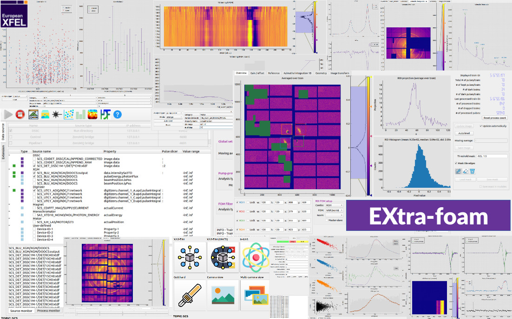

EXtra-foam
==========

*EXtra-foam* is a framework that provides real-time and off-line data analysis (**detector geometry**, 
**pump-probe**, **azimuthal integration**, **ROI**, **statistics**, etc.) and visualization for experiments 
that use **2D area detectors** (*AGIPD*, *LPD*, *DSSC*, *FastCCD*, *JungFrau*, *ePix100*, etc.) and 
**1D detectors** (*Gotthard*, *XGM*, *digitizer*, etc.) at European XFEL.

[Documentation](https://extra-foam.readthedocs.io/en/latest/)
