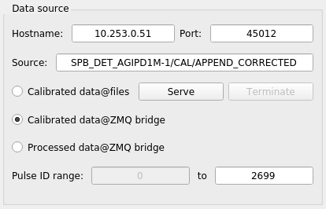
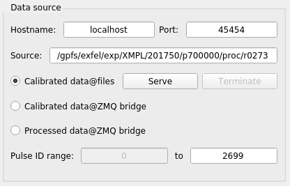

Data Analysis with karaboFAI
============================

Real-time data analysis
#######################

To start **karaboFAI** on any online cluster:

.. code-block:: bash

    /gpfs/exfel/sw/software/karaboFAI/env/bin/karaboFAI DETECTOR_NAME

Valid detectors are `AGIPD`, `LPD` and `JungFrau`.

.. note::
   It usually takes a long time to start **karaboFAI** for the first time! This
   is actually an issue related to the infrastructure and not because
   **karaboFAI** is slow.

For real-time data analysis, the (calibrated) data is streamed via a
`ZMQ bridge`, which is a `Karabo` device (`PipeToZeroMQ`) running inside the control network.
Normally, the user should not modify ``Hostname``, ``Port`` and ``Source`` in
the ``Data source`` panel.

.. list-table:: Suggested online clusters
   :header-rows: 1

   * - Instrument
     - Alias
     - DNS primary name

   * - SPB
     - sa1-br-onc-comp-spb
     - exflonc05
   * - FXE
     - sa1-br-onc-comp-fxe
     - exflonc12
   * - SCS
     - sa1-br-kc-comp-1
     - exflonc13
   * - SQS
     - sa1-br-kc-comp-3
     - exflonc15

Off-line data analysis
######################

For now, **karaboFAI** can be used to replay the experiment with files.

The way to start **karaboFAI** on `Maxwell` cluster is the same as on the
online cluster:

.. code-block:: bash

    /gpfs/exfel/sw/software/karaboFAI/env/bin/karaboFAI DETECTOR_NAME

For off-line data analysis, the data is streamed from files after the
``Serve`` button is clicked. The user is free to use any available ``port``.
``Hostname`` is usually `localhost`, but it can also be a remote machine.
Different from the real-time case, ``Source`` here refers to the full path
of the directory which contains the (calibrated) files.

.. list-table:: Example files
   :header-rows: 1

   * - Detector
     - File directory

   * - AGIPD
     - /gpfs/exfel/exp/XMPL/201750/p700000/proc/r0273
   * - LPD
     - /gpfs/exfel/exp/FXE/201701/p002026/proc/r0078
   * - JungFrau
     - /gpfs/exfel/exp/FXE/201801/p002118/proc/r0143
   * - FastCCD
     -

Main GUI
########

The main GUI of **karaboFAI** is divided into several control panels with different
functions and a log window.

General analysis setup panel
----------------------------

Correlation analysis setup panel
--------------------------------

Pump-probe analysis setup panel
-------------------------------

Geometry setup panel
--------------------

Geometry setup panel is only available for the detector which requires a geometry
file to assembled the images from different modules, for example, AGIPD and LPD.

Data source setup panel
-----------------------
