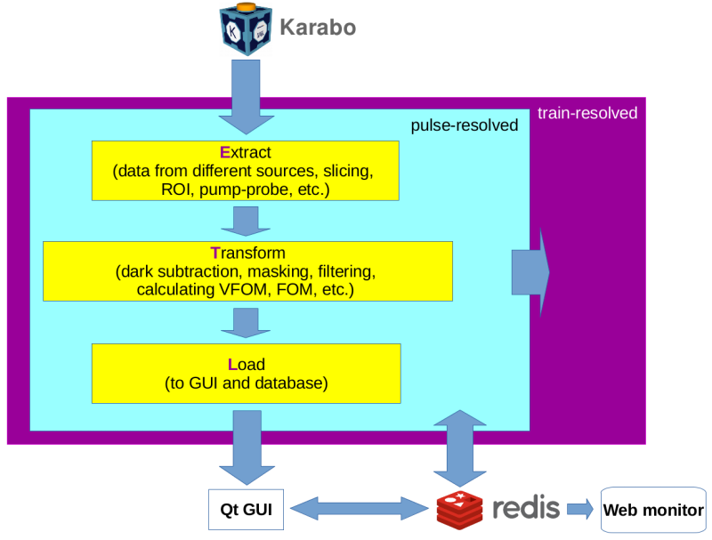

DEVELOPER
=========

Design
""""""

Build and Test
""""""""""""""

.. _GoogleTest: https://github.com/google/googletest

Before running the Python unittest, rebuild the c++ code if it was updated. One can do either

.. code-block:: bash

    $ pip install -e . -v

or

.. code-block:: bash

    $ python setup.py build_ext --with-tests --inplace

Then, run the both C++ and Python unittests:

.. code-block:: bash

    $ python setup.py test

To only run the Python unittest:

.. code-block:: bash

    $ python -m pytest extra_foam -v -s

To build and run the c++ unittest only (we use GoogleTest_):

.. code-block:: bash

    $ mkdir build && cd build
    $ cmake -DBUILD_FOAM_TESTS .. && make ftest

To run the Python benchmark:

.. code-block:: bash

    $ python setup.py benchmark

Release **EXtra-foam**
""""""""""""""""""""""

- Update the **changeLog**;
- Update the version number in `extra_foam/__init__.py`;
- Merge the above change into the `dev` branch;
- Merge the `dev` branch into the `master` branch;
- Tag the `master` branch;
- Create a new branch from the new `master` branch and update the version number in
  `extra_foam/__init__.py`. For example, if the latest release version is "0.8.0",
  the new version number should be "0.8.1dev", supposing the next release is 0.8.1.
  Also, the name of the new branch should be "0.8.1dev";
- Merge the new branch into the `dev` branch;

Deployment on EuXFEL Anaconda Environment
"""""""""""""""""""""""""""""""""""""""""

**EXtra-foam** deployment on exfel anaconda environments should be done using
**xsoft** account. Use the following anaconda environments to deploy particular
versions of **EXtra-foam**

.. list-table::
   :header-rows: 1

   * - Version
     - Deployment environment

   * - Latest
     - EXtra-foam/beta

   * - Stable
     - EXtra-foam

   * - Test
     - EXtra-foam/alpha

.. code-block:: console

   $ ssh xsoft@max-display.desy.de
   $ cd workspace
   $ git clone --recursive --branch <tag_name> https://github.com/European-XFEL/EXtra-foam.git EXtra-foam-<tag_name>
   $ cd EXtra-foam-<tag_name>
   $ module load exfel <environment_name>
   $ which pip
   /gpfs/exfel/sw/software/<environment_name>/bin/pip
   $ pip install . -v

.. note::

   ssh to the Maxwell and online cluster with your own account, 
   respectively, and launch **EXtra-foam** there to double check the deployed version.
