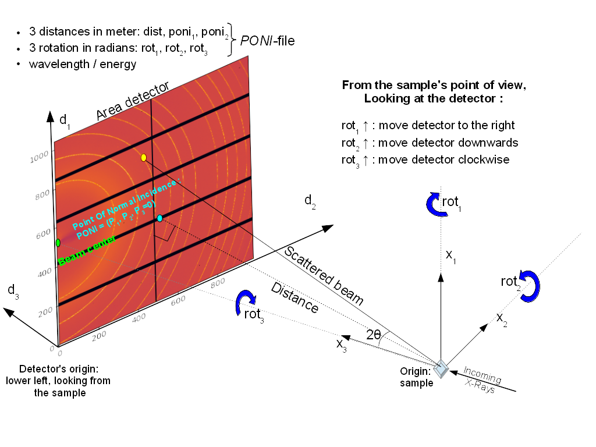
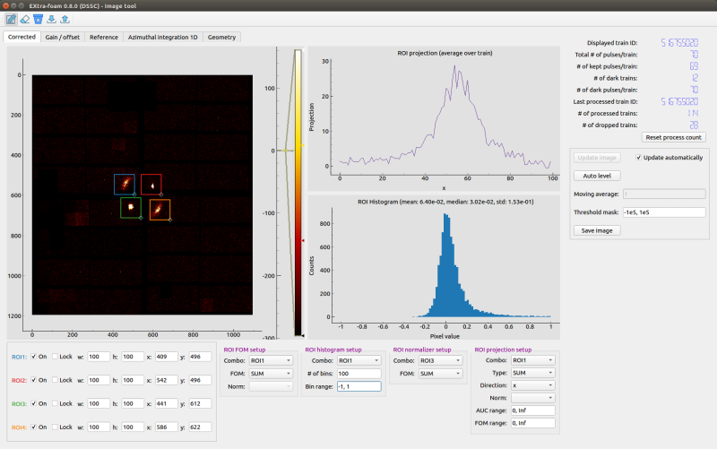

Graphical User Interface (GUI)
==============================

.. _pyFAI: https://github.com/silx-kit/pyFAI
.. _karabo_data: https://github.com/European-XFEL/karabo_data

.. _nanmean: https://docs.scipy.org/doc/numpy/reference/generated/numpy.nanmean.html

The main GUI of **karaboFAI** is divided into several control panels grouped
by functionality and a log window. Train-resolved detectors without geometry
have less control options than pulse-resolved detectors with geometry, for
example, the *Geometry setup panel*, the *Pulse index filter* in the *General
setup* pannel.

Important concepts:

.. _AnalysisType:

- Analysis type (to be finalized):

.. list-table:: Analysis types
   :header-rows: 1

   * - Type
     - Description

   * - **pump-probe**
     - ...
   * - proj X
     - ...
   * - proj Y
     - ...
   * - ROI1 - ROI2
     - ...
   * - ROI1 / ROI2
     - ...

MainGUI
-------

General setup
"""""""""""""

Define the general analysis setup.

+--------------------------+----------------------------------------------------------------------+
| Input                    | Description                                                          |
+==========================+======================================================================+
| **Pulse index filter**   | A filter which select the specified indices in a train.              |
|                          | *Pulse-resolved detector only*.                                      |
+--------------------------+----------------------------------------------------------------------+
| **Pulse of interest 1**  | Index of the first pulse of interest (POI). Besides the average of   |
|                          | all pulses in a train, **karaboFAI** allows users to select two      |
|                          | individual pulses to monitor. *Pulse-resolved detector only.*        |
+--------------------------+----------------------------------------------------------------------+
| **Pulse of interest 2**  | Index of the 2nd POI pulse. *Pulse-resolved detector only.*          |
+--------------------------+----------------------------------------------------------------------+
| **Photon energy**        | Photon energy in keV. Only used in azimuthal integration for now.    |
+--------------------------+----------------------------------------------------------------------+
| **Sample distance**      | Sample-detector distance in m. Only used in azimuthal integration.   |
+--------------------------+----------------------------------------------------------------------+

Pump-probe setup
""""""""""""""""

In the *pump-probe* analysis, the average (nanmean_) images of the on- and off- pulses are
calculated by

.. math::

   \bar{I}_{on} = \Sigma I_{on} / N_{on}

   \bar{I}_{off} = \Sigma I_{off} / N_{off} .

Then, an operation is performed on the averaged images based on the analysis type:

.. math::

   \theta_{on} = f(\bar{I}_{on})

   \theta_{off} = f(\bar{I}_{off}),

where `f` is determined by the analysis type. :math:`\theta_{on}` and :math:`\theta_{off}` will
be plotted in the *pump-probe* window if they are 1D arrays. And their difference
:math:`\theta_{on} - \theta_{off}` will also be visualized in the same window. Finally, the
figure-of-merit (FOM) will be calculated.

+-------------------------------+------------------------------------------------------------------+
| Input                         | Description                                                      |
+===============================+==================================================================+
| **On/off mode**               | Pump-probe analysis mode:                                        |
|                               | - **predefined off**: On-pulses will be taken from each train    |
|                               | while the 'off'\/reference image is specified in the ImageTool.  |
|                               | - **same train**: On-pulses and off-pulses will be taken from    |
|                               | the same train. Not applicable to train-resolved detectors.      |
|                               | - **even\/odd**: On-pulses will be taken from trains with even   |
|                               | train IDs while off-pulses will be taken from trains with odd    |
|                               | train IDs.                                                       |
|                               | - **odd\/even**: On-pulses will be taken from trains with odd    |
|                               | train IDs while off-pulses will be taken from trains with even   |
|                               | train IDs.                                                       |
+-------------------------------+------------------------------------------------------------------+
| **Analysis type**             | See AnalysisType_.                                               |
+-------------------------------+------------------------------------------------------------------+
| **On-pulse indices**          | Indices of all on-pulses. *Pulse-resolved detector only.*        |
+-------------------------------+------------------------------------------------------------------+
| **Off-pulse indices**         | Indices of all off-pulses. *Pulse-resolved detector only.*       |
+-------------------------------+------------------------------------------------------------------+
| **Moving average window**     | If the moving average window size is larger than 1, moving       |
|                               | average will be applied to the azimuthal integration and 1D      |
|                               | projection result.                                               |
+-------------------------------+------------------------------------------------------------------+
| **FOM from absolute on-off**  | If this checkbox is ticked, the FOM will be calculated based on  |
|                               | `\|on - off\|` (default). Otherwise `on - off`.                  |
+-------------------------------+------------------------------------------------------------------+

Azimuthal integration analysis setup
""""""""""""""""""""""""""""""""""""

**karaboFAI** uses pyFAI_ to do azimuthal integration. As illustrated in the sketch below,
the **origin** is located at the sample position, more precisely, where the X-ray beam crosses
the main axis of the diffractometer. The detector is treated as a rigid body, and its position
in space is described by six parameters: 3 translations and 3 rotations. The orthogonal
projection of **origin** on the detector surface is called **PONI** (Point Of Normal Incidence).
For non-planar detectors, **PONI** is defined in the plan with z=0 in the detector’s coordinate
system. It is worth noting that usually **PONI** is not the beam center on the detector surface.

The input parameters *Cx* and *Cy* correspond to *Poni2* and *Poni1* in the
aforementioned coordinate system, respectively.

==========================  =======================================================================
Input                       Description
==========================  =======================================================================
**Cx (pixel)**              | Coordinate of the point of normal incidence along the detector's 2nd
                            | dimension, in pixels.
**Cy (pixel)**              | Coordinate of the point of normal incidence along the detector's 1st
                            | dimension, in pixels.
**Integ method**            | Azimuthal integration methods provided by pyFAI_.
**Integ points**            | Number of points in the output pattern of azimuthal integration.
**Integ range**             | Azimuthal integration range, in 1/A.
**Normalizer**              | Normalizer of the azimuthal integration result.
**AUC range**               | AUC (area under a curve) integration range, in 1/A.
**FOM range**               | Integration range when calculating the figure-of-merit of the
                            | azimuthal integration result, in 1/A.
**Pulsed azimuthal integ**  | If this checkbox is ticked, azimuthal integration will be calculated
                            | pulse by pulse, which takes longer time. For now, this is only
                            | required by the *Pulsed A.I.* window.
==========================  =======================================================================

**ROI analysis setup**
""""""""""""""""""""""

Define the ROI (region of interest) analysis setup.

=========================  ========================================================================
Input                      Description
=========================  ========================================================================
**Normalizer (proj X/Y)**  | Normalizer of the 1D-projection array.
**AUC range (proj X/Y)**   | AUC (area under a curve) integration range.
**FOM range**              | Integration range when calculating the figure-of-merit of 1D projection.
**ROI FOM**                | Calculate the ROI figure-of-merit by
                           | - **sum**: summing up the ROI pixel values.
                           | - **mean**: averaging the ROI pixel values.
=========================  ========================================================================

**Data source setup**

Binning setup
"""""""""""""

=========================  ========================================================================
Input                      Description
=========================  ========================================================================
**Analysis type**          | See AnalysisType_.
**Mode**                   | The data in each bin will be
                           | - **accumulate**: summed up.
                           | - **average**: averaged.
=========================  ========================================================================

Correlation setup
"""""""""""""""""

=========================  ========================================================================
Input                      Description
=========================  ========================================================================
**Analysis type**          | See AnalysisType_.
=========================  ========================================================================

Geometry setup
""""""""""""""

Geometry setup panel is only available for the multi-module detector which requires a
geometry file to assemble the images from different modules, for example, AGIPD, LPD and
DSSC. **karaboFAI** uses karabo_data_ for image assembling. For detailed information
about geometries of those detectors, please refer to
https://karabo-data.readthedocs.io/en/latest/geometry.html

=========================  ========================================================================
Input                      Description
=========================  ========================================================================
**Quadrant positions**     | The first pixel of the first module in each quadrant, corresponding
                           | to data channels 0, 4, 8 and 12.
**Load geometry file**     | Open a *FileDialog* window to choose a geometry file from the local
                           | file system. For LPD and DSSC, **karaboFAI** provides a default
                           | geometry file.
=========================  ========================================================================

The quadrant positions are given in pixel units,

ImageTool
---------

The *ImageTool* is the second control window which provides various operations on images.

=========================  ========================================================================
Input                      Description
=========================  ========================================================================
**Moving average**         | Moving average window size (on the basis of trains) of image data.
                           | It is worth noting that if the new window size is smaller than the
                           | current one, the internal moving average count will be set to 1.
**Threshold mask**         | An interval that pixel values outside the interval are clipped to
                           | the interval edges.
**Subtract background**    | A fixed background value to be subtracted from all the pixel values.
=========================  ========================================================================

The action bar provides several actions for real-time masking operation. One should keep in
mind that image mask is **only** used in azimuthal integration.

=========================  ========================================================================
Action                     Description
=========================  ========================================================================
**Mask**                   | Mask a rectangular region.
**Unmask**                 | Remove mask in a rectangular region.
**Trash mask**             | Remove all the mask.
**Save image mask**        | Save the current image mask in `.npy` format.
**Load image mask**        | Load a image mask in `.npy` format.
=========================  ========================================================================

You can activate (tick **On**) up to 4 ROIs at the same time. One can change the size
(**w**\idth, **h**\eight) and position (**x**\, **y**\) of an ROI by either dragging and moving
the ROI on the image or entering numbers. You can avoid modifying an ROI unwittingly by
**Lock**\ing it.

Other buttons in the *ImageTool* window:

=========================  ========================================================================
Button                     Description
=========================  ========================================================================
**Update image**           | Update the current displayed image in the *ImageTool* window.
**Auto level**             | Update the detector images (not only in the *ImageTool* window, but
                           | also in other PlotWindows) by automatically selecting levels based
                           | on the maximum and minimum values in the data.
**Set reference**          | Set the current displayed image as a reference image. For now,
                           | reference image is used as a stationary off-image in the **predefined**
                           | **off** mode in *pump-probe* analysis.
**Remove reference**       | Remove the reference image.
=========================  ========================================================================