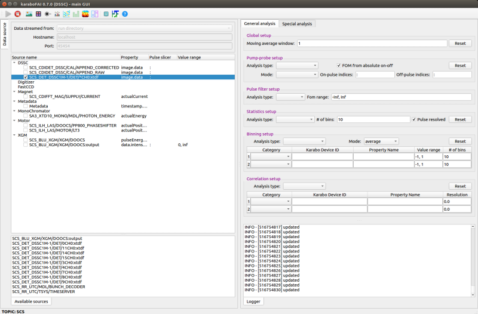

GRAPHICAL USER INTERFACE (GUI)
==============================

.. _pyFAI: https://github.com/silx-kit/pyFAI
.. _karabo_data: https://github.com/European-XFEL/karabo_data

.. _nanmean: https://docs.scipy.org/doc/numpy/reference/generated/numpy.nanmean.html

The main GUI of **karaboFAI** is divided into several control panels grouped
by functionality and a log window.

Important concepts:

.. _AnalysisType:

- **Analysis type**:

Each analysis type starts from an (ROI) image and will generate a FOM (figure-of-merit) and a VFOM
(vector figure-of-merit). Take the analysis type *ROI1 - ROI2 (proj)* for example, it starts
from the image which is the subtraction of ROI1 and ROI2. The VFOM is the projection of this image in
the x or y direction, and the FOM the sum of the absolute VFOM.

.. list-table::
   :header-rows: 1

   * - Type
     - Description
     - VFOM
     - FOM

   * - *pump-probe*
     - See *Pump-probe setup*.
     - VFOM (on) minus VFOM (off).
     - Sum of the (absolute) on-off VFOM.

   * - *ROI1*
     - Sum ROI1.
     - NA
     - Sum of the pixel values within ROI1.

   * - *ROI2*
     - Sum ROI2.
     - NA
     - Sum of the pixel values within ROI2.

   * - *ROI1 - ROI2*
     - Subtract of two ROI regions.
     - NA
     - Sum of the pixel values within ROI1 - ROI2 (ROI1 and ROI2 must have the same shape).

   * - *ROI1 + ROI2*
     - Sum of two ROI regions.
     - NA
     - Sum of the pixel values within ROI1 + ROI2 (ROI1 and ROI2 must have the same shape).

   * - *ROI1 (proj)*
     - 1D projection in x/y direction of ROI1.
     - Projection of ROI1 in the x/y direction.
     - Sum of the absolute projection.

   * - *ROI2 (proj)*
     - 1D projection in x/y direction of ROI2.
     - Projection of ROI2 in the x/y direction.
     - Sum of the absolute projection.

   * - *ROI1 - ROI2 (proj)*
     - 1D projection in x/y direction of the subtraction of two ROI regions.
     - Projection of ROI1 - ROI2 in the x/y direction.
     - Sum of the absolute projection.

   * - *ROI1 + ROI2 (proj)*
     - 1D projection in x/y direction of the sum of two ROI regions.
     - Projection of ROI1 + ROI2 in the x/y direction.
     - Sum of the absolute projection.

   * - *azimuthal integ*
     - Azimuthal integration of average (pulse) image(s) in a train.
     - Azimuthal integration scattering curve.
     - Sum of the (absolute) scattering curve.

General setup
"""""""""""""

Define the general analysis setup.

+----------------------------+--------------------------------------------------------------------+
| Input                      | Description                                                        |
+============================+====================================================================+
| *Pulse index filter*       | A filter which selects the specified indices in a train.           |
|                            | *Pulse-resolved detector only*.                                    |
+----------------------------+--------------------------------------------------------------------+
| *POI index 1*              | Index of the first pulse of interest (POI). Besides the average of |
|                            | all pulses in a train, **karaboFAI** allows users to select two    |
|                            | individual pulses to monitor. *Pulse-resolved detector only.*      |
+----------------------------+--------------------------------------------------------------------+
| *POI index 2*              | Index of the 2nd POI pulse. *Pulse-resolved detector only.*        |
+----------------------------+--------------------------------------------------------------------+
| *Photon energy*            | Photon energy in keV. Only used in azimuthal integration for now.  |
+----------------------------+--------------------------------------------------------------------+
| *Sample distance*          | Sample-detector distance in m. Only used in azimuthal integration. |
+----------------------------+--------------------------------------------------------------------+
| *M.A. window*              | Moving average window size. If the moving average window size is   |
|                            | larger than 1, moving average will be applied to all the           |
|                            | registered analysis types. If the new window size is smaller than  |
|                            | the old one, the moving average calculation will start from the    |
|                            | scratch.                                                           |
+----------------------------+--------------------------------------------------------------------+
| Reset M.A.                 | Reset the moving average counts of all registered analysis types.  |
+----------------------------+--------------------------------------------------------------------+

Pump-probe setup
""""""""""""""""

In the *pump-probe* analysis, the average (nanmean_) images of the on- and off- pulses are
calculated by

.. math::

   \bar{I}_{on} = \Sigma I_{on} / N_{on}

   \bar{I}_{off} = \Sigma I_{off} / N_{off} .

Then, moving averages of VFOM (on) and VFOM (off) for :math:`\bar{I}_{on}` and :math:`\bar{I}_{off}`
will be calculated, respectively, depending on the specified analysis type. The VFOM of *pump-probe*
analysis is given by VFOM (on) - VFOM (off).

+----------------------------+--------------------------------------------------------------------+
| Input                      | Description                                                        |
+============================+====================================================================+
| *On/off mode*              | Pump-probe analysis mode:                                          |
|                            |                                                                    |
|                            | - *predefined off*:                                                |
|                            |                                                                    |
|                            |   On-pulses will be taken from each train while the 'off'          |
|                            |   (reference image) is specified in the ImageTool.                 |
|                            |                                                                    |
|                            | - *same train*:                                                    |
|                            |                                                                    |
|                            |   On-pulses and off-pulses will be taken from the same train. Not  |
|                            |   applicable to train-resolved detectors.                          |
|                            |                                                                    |
|                            | - *even\/odd*:                                                     |
|                            |                                                                    |
|                            |   On-pulses will be taken from trains with even train IDs while    |
|                            |   off-pulses will be taken from trains with odd train IDs.         |
|                            |                                                                    |
|                            | - *odd\/even*:                                                     |
|                            |                                                                    |
|                            |   On-pulses will be taken from trains with odd train IDs while     |
|                            |   off-pulses will be taken from trains with even train IDs.        |
+----------------------------+--------------------------------------------------------------------+
| *Analysis type*            | See AnalysisType_.                                                 |
+----------------------------+--------------------------------------------------------------------+
| *On-pulse indices*         | Indices of all on-pulses. *Pulse-resolved detector only.*          |
+----------------------------+--------------------------------------------------------------------+
| *Off-pulse indices*        | Indices of all off-pulses. *Pulse-resolved detector only.*         |
+----------------------------+--------------------------------------------------------------------+
| *FOM from absolute on-off* | If this checkbox is ticked, the FOM will be calculated based on    |
|                            | `\|on - off\|` (default). Otherwise `on - off`.                    |
+----------------------------+--------------------------------------------------------------------+
| Reset                      | Reset the FOM plot in the *Pump-probe window* and the global       |
|                            | moving average count.                                              |
+----------------------------+--------------------------------------------------------------------+

Azimuthal integration analysis setup
""""""""""""""""""""""""""""""""""""

**karaboFAI** uses pyFAI_ to do azimuthal integration. As illustrated in the sketch below,
the **origin** is located at the sample position, more precisely, where the X-ray beam crosses
the main axis of the diffractometer. The detector is treated as a rigid body, and its position
in space is described by six parameters: 3 translations and 3 rotations. The orthogonal
projection of **origin** on the detector surface is called **PONI** (Point Of Normal Incidence).
For non-planar detectors, **PONI** is defined in the plan with z=0 in the detector’s coordinate
system. It is worth noting that usually **PONI** is not the beam center on the detector surface.

The input parameters *Cx* and *Cy* correspond to *Poni2* and *Poni1* in the
aforementioned coordinate system, respectively.

.. image:: images/pyFAI_PONI.png
   :width: 800

+----------------------------+--------------------------------------------------------------------+
| Input                      | Description                                                        |
+============================+====================================================================+
| *Cx (pixel)*               | Coordinate of the point of normal incidence along the detector's   |
|                            | 2nd dimension, in pixels.                                          |
+----------------------------+--------------------------------------------------------------------+
| *Cy (pixel)*               | Coordinate of the point of normal incidence along the detector's   |
|                            | 1st dimension, in pixels.                                          |
+----------------------------+--------------------------------------------------------------------+
| *Integ method*             | Azimuthal integration methods provided by pyFAI_.                  |
+----------------------------+--------------------------------------------------------------------+
| *Integ points*             | Number of points in the output pattern of azimuthal integration.   |
+----------------------------+--------------------------------------------------------------------+
| *Integ range*              | Azimuthal integration range, in 1/A.                               |
+----------------------------+--------------------------------------------------------------------+
| *Normalizer*               | Normalizer of the azimuthal integration result.                    |
+----------------------------+--------------------------------------------------------------------+
| *AUC range*                | AUC (area under a curve) integration range, in 1/A.                |
+----------------------------+--------------------------------------------------------------------+
| *FOM range*                | Integration range when calculating the figure-of-merit of the      |
|                            | azimuthal integration result, in 1/A.                              |
+----------------------------+--------------------------------------------------------------------+

ROI 1D projection analysis setup
""""""""""""""""""""""""""""""""

Define the 1D projection of ROI (region of interest) analysis setup.

+----------------------------+--------------------------------------------------------------------+
| Input                      | Description                                                        |
+============================+====================================================================+
| *Direction*                | Direction of 1D projection (x or y).                               |
+----------------------------+--------------------------------------------------------------------+
| *Normalizer*               | Normalizer of the 1D-projection VFOM.                              |
+----------------------------+--------------------------------------------------------------------+
| *AUC range*                | AUC (area under a curve) integration range.                        |
+----------------------------+--------------------------------------------------------------------+
| *FOM range*                | Integration range when calculating the figure-of-merit of 1D       |
|                            | projection.                                                        |
+----------------------------+--------------------------------------------------------------------+

Data source
"""""""""""

+----------------------------+--------------------------------------------------------------------+
| Input                      | Description                                                        |
+============================+====================================================================+
| *Data streamed from*       | Receiving the data from                                            |
|                            |                                                                    |
|                            | - *ZeroMQ bridge*: mainly used for real-time analysis. The data    |
|                            |   will be sent from a *PipeToZeroMQ* Karabo device;                |
|                            |                                                                    |
|                            | - *run directory*: used for replaying the experiment.              |
+----------------------------+--------------------------------------------------------------------+
| *Hostname*                 | Hostname of the data source.                                       |
+----------------------------+--------------------------------------------------------------------+
| *Port*                     | Port number of the data source.                                    |
+----------------------------+--------------------------------------------------------------------+
| *Detector source name*     | *KaraboDeviceID* for multi-module detectors and                    |
|                            | *KaraboDeviceID:outputChannel* for single-module detectors         |
+----------------------------+--------------------------------------------------------------------+

Statistics setup
""""""""""""""""

Setup the visualization of pulse- / train- resolved statistics analysis.

+----------------------------+--------------------------------------------------------------------+
| Input                      | Description                                                        |
+============================+====================================================================+
| *Analysis type*            | See AnalysisType_.                                                 |
+----------------------------+--------------------------------------------------------------------+
| *# of bins*                | Number of bins of the histogram.                                   |
+----------------------------+--------------------------------------------------------------------+
| *Reset*                    | Reset the histogram history.                                       |
+----------------------------+--------------------------------------------------------------------+

Binning setup
"""""""""""""

Setup the visualization of 1D/2D binning of the FOM and VFOM for a certain AnalysisType_.

+----------------------------+--------------------------------------------------------------------+
| Input                      | Description                                                        |
+============================+====================================================================+
| *Analysis type*            | See AnalysisType_.                                                 |
+----------------------------+--------------------------------------------------------------------+
| *Mode*                     | The data in each bin will be                                       |
|                            |                                                                    |
|                            | - *average*: averaged;                                             |
|                            |                                                                    |
|                            | - *accumulate*: summed up.                                         |
+----------------------------+--------------------------------------------------------------------+
| *Category*                 | Category of the slow data.                                         |
+----------------------------+--------------------------------------------------------------------+
| *Karabo device ID*         | ID of the Karabo device which produces the slow data.              |
+----------------------------+--------------------------------------------------------------------+
| *Property name*            | Property name in the Karabo device.                                |
+----------------------------+--------------------------------------------------------------------+
| *Value range*              | (Min, max) value of the bins.                                      |
+----------------------------+--------------------------------------------------------------------+
| *# of bins*                | Number of bins.                                                    |
+----------------------------+--------------------------------------------------------------------+
| *Reset*                    | Reset the binning history.                                         |
+----------------------------+--------------------------------------------------------------------+

Correlation setup
"""""""""""""""""

Setup the visualization of correlations of a given FOM with various slow data.

+----------------------------+--------------------------------------------------------------------+
| Input                      | Description                                                        |
+============================+====================================================================+
| *Analysis type*            | See AnalysisType_.                                                 |
+----------------------------+--------------------------------------------------------------------+
| *Category*                 | Category of the slow data.                                         |
+----------------------------+--------------------------------------------------------------------+
| *Karabo device ID*         | ID of the Karabo device which produces the slow data.              |
+----------------------------+--------------------------------------------------------------------+
| *Property name*            | Property name in the Karabo device.                                |
+----------------------------+--------------------------------------------------------------------+
| *Resolution*               | 0 for scattering plot and any positive value for bar plot          |
+----------------------------+--------------------------------------------------------------------+
| *Reset*                    | Reset the correlation history.                                     |
+----------------------------+--------------------------------------------------------------------+

Geometry setup
""""""""""""""

Geometry setup panel is only available for the multi-module detector which requires a
geometry file to assemble the images from different modules, for example, AGIPD, LPD and
DSSC. **karaboFAI** uses karabo_data_ for image assembling. For detailed information
about geometries of those detectors, please refer to
https://karabo-data.readthedocs.io/en/latest/geometry.html

+----------------------------+--------------------------------------------------------------------+
| Input                      | Description                                                        |
+============================+====================================================================+
| *Quadrant positions*       | The first pixel of the first module in each quadrant,              |
|                            | corresponding to data channels 0, 4, 8 and 12.                     |
+----------------------------+--------------------------------------------------------------------+
| *Load geometry file*       | Open a *FileDialog* window to choose a geometry file from the      |
|                            | local file system. For LPD and DSSC, **karaboFAI** provides a      |
|                            | default geometry file.                                             |
+----------------------------+--------------------------------------------------------------------+

The quadrant positions are given in pixel units,
