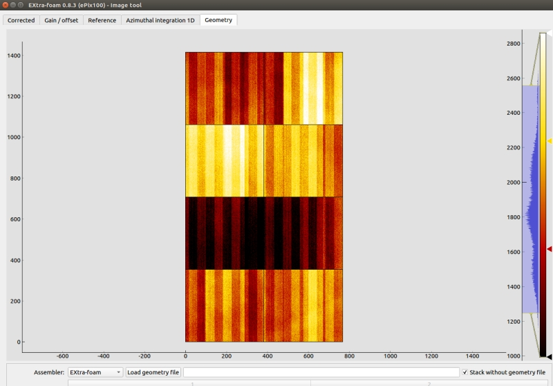
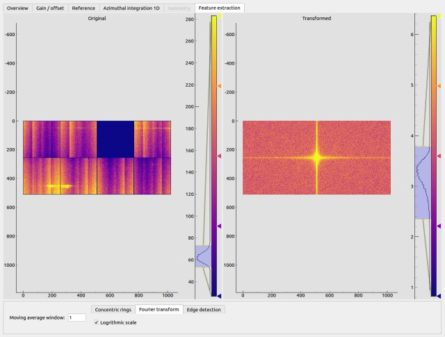

.. _Image tool:

IMAGE TOOL
==========

.. _pyFAI: https://github.com/silx-kit/pyFAI
.. _imageio: https://github.com/imageio/imageio
.. _clipping: https://docs.scipy.org/doc/numpy/reference/generated/numpy.clip.html

The *ImageTool* window is the second control window which provides various image-related
information and controls.

Image control
-------------

+----------------------------+--------------------------------------------------------------------+
| Input                      | Description                                                        |
+============================+====================================================================+
| ``Update image``           | Manually update the current displayed image in the *ImageTool*     |
|                            | window. Disabled if *Update automatically* is checked.             |
+----------------------------+--------------------------------------------------------------------+
| ``Update automatically``   | Automatically update the current displayed image in the            |
|                            | *ImageTool* window.                                                |
+----------------------------+--------------------------------------------------------------------+
| ``Moving average``         | Apply moving average to the image data. It affects both the        |
|                            | individual images in a train and the averaged image, as well as    |
|                            | the subsequent analysis. If a new window size is smaller than      |
|                            | the old one, the moving average calculation will start from the    |
|                            | scratch.                                                           |
+----------------------------+--------------------------------------------------------------------+
| ``Auto level``             | Update the detector images (not only in the *ImageTool* window,    |
|                            | but also in other plot windows) by automatically selecting levels  |
|                            | based on the maximum and minimum values in the data.               |
+----------------------------+--------------------------------------------------------------------+
| ``Save image``             | Save the current image to file. Please also see ImageFileFormat_   |
+----------------------------+--------------------------------------------------------------------+

.. Warning::

    The moving average here is not calculated by nanmean_, which means that if a pixel of the image
    in a certain pulse is *NaN*, the moving average of that pixel will be *NaN* for that pulse.

.. Warning::

    Please be aware that there is another moving average setup in the :ref:`Global setup` in the
    main GUI.

Mask panel
""""""""""

Besides the nan pixels inherited from the calibration pipeline, users are allowed to mask additional
pixels to nan in this panel with threshold mask, tile edge mask and image mask.

It should be noted that image mask is treated differently in **EXtra-foam**. One can draw and erase
image mask at run time as well as save/load it as an assembled image or in modules if the detector
has a geometry. Nan pixels outside the masked region of the image mask will not be saved and thus
will also not be overwritten after loading an image mask from file.

+----------------------------+--------------------------------------------------------------------+
| Input                      | Description                                                        |
+============================+====================================================================+
| ``Threshold mask``         | An interval that pixels with values outside the interval will be   |
|                            | masked. Please distinguish *threshold mask* from clipping_.        |
+----------------------------+--------------------------------------------------------------------+
| ``Mask tile edges``        | Mask the edge pixel of each tile. *Only applicable for AGIPD, LPD  |
|                            | and DSSC if EXtra-foam is selected as the* ``Assembler`` *in*      |
|                            | :ref:`Geometry`.                                                   |
+----------------------------+--------------------------------------------------------------------+
| ``Mask ASIC edges``        | Mask the edge pixel of each ASIC. *Only applicable for JungFrau    |
|                            | and ePix100.*                                                      |
+----------------------------+--------------------------------------------------------------------+
| ``Draw``                   | Draw mask in a rectangular region. *Only available in the          |
|                            | Corrected panel.*                                                  |
+----------------------------+--------------------------------------------------------------------+
| ``Erase``                  | Erase mask in a rectangular region. *Only available in the         |
|                            | Corrected panel.*                                                  |
+----------------------------+--------------------------------------------------------------------+
| ``Remove mask``            | Remove the image mask.                                             |
+----------------------------+--------------------------------------------------------------------+
| ``Load mask``              | Load an image mask in `.npy` format. The dtype of the loaded       |
|                            | numpy array will be casted into bool if it is not. For detectors   |
|                            | with a geometry, it is allowed to load an image mask in modules,   |
|                            | i.e., an array which has the shape (modules, ss, fs).              |
+----------------------------+--------------------------------------------------------------------+
| ``Save mask``              | Save the current image mask in `.npy` format.                      |
+----------------------------+--------------------------------------------------------------------+
| ``Save mask in modules``   | Save image mask in modules. *Only applicable for AGIPD, LPD        |
|                            | and DSSC if EXtra-foam is selected as the* ``Assembler`` *in*      |
|                            | :ref:`Geometry`.                                                   |
+----------------------------+--------------------------------------------------------------------+

ROI manipulation
""""""""""""""""

You can activate (tick **On**) up to 4 ROIs at the same time. One can change the size
(**w**\idth, **h**\eight) and position (**x**\, **y**\) of an ROI by either dragging and moving
the ROI on the image or entering numbers. You can avoid modifying an ROI unwittingly by
**Lock**\ing it.

.. _ROI FOM setup:

ROI FOM setup
"""""""""""""

+----------------------------+--------------------------------------------------------------------+
| Input                      | Description                                                        |
+============================+====================================================================+
| ``Combo``                  | ROI combination, including *ROI1*, *ROI2*, *ROI1 + ROI2*,          |
|                            | *ROI1 - ROI2*, and *ROI1 / ROI2*.                                  |
+----------------------------+--------------------------------------------------------------------+
| ``FOM``                    | ROI FOM type, including *SUM*, *MEAN*, *MEDIAN*, *MIN*, *MAX*.     |
|                            | *STD*, *VAR*, *STD (norm)* and *VAR (norm)*.                       |
+----------------------------+--------------------------------------------------------------------+
| ``Norm``                   | Normalizer of ROI FOM. *Only applicable for train-resolved and     |
|                            | pump-probe analysis*.                                              |
+----------------------------+--------------------------------------------------------------------+
| ``Master-slave``           | Check to activate the *master-slave* model. This model is used     |
|                            | exclusively in :ref:`Correlation` window.                          |
|                            | When it is activated, FOMs of ROI1 (master) and ROI2 (slave) will  |
|                            | be plotted in the same correlation plot. For other statistics      |
|                            | analysis like binning and histogram, only ROI1 FOM will be used.   |
+----------------------------+--------------------------------------------------------------------+

- *STD (norm)* is defined as the ratio between the standard deviation and the mean.

- *VAR (norm)* is defined as the ratio between the variance and the square of the mean.

ROI histogram setup
"""""""""""""""""""

+----------------------------+--------------------------------------------------------------------+
| Input                      | Description                                                        |
+============================+====================================================================+
| ``Combo``                  | ROI combination, e.g. *ROI1*, *ROI2*, *ROI1 + ROI2*, *ROI1 - ROI2*.|
+----------------------------+--------------------------------------------------------------------+
| ``Bin range``              | Lower and upper boundaries of all the bins. In case of *+/- Inf*,  |
|                            | the boundary will be calculated dynamically.                       |
+----------------------------+--------------------------------------------------------------------+
| ``# of bins``              | Number of bins of the histogram.                                   |
+----------------------------+--------------------------------------------------------------------+

ROI normalizer setup
""""""""""""""""""""

The settings for this are on the *ROI normalizer settings* tab. The
normalization source can either be the main detector, or some other 2D source
image. To use a different source, such as a camera, add it as a pipeline source
(purple square) in the :ref:`Data source tree` under the *User-defined* section,
and if it is a 2D image it will be displayed as an option in the *ROI source*
list.

+----------------------------+--------------------------------------------------------------------+
| Input                      | Description                                                        |
+============================+====================================================================+
| ``ROI source``             | Source to compute the normalization factor from.                   |
+----------------------------+--------------------------------------------------------------------+
| ``Combo``                  | ROI combination, e.g. *ROI3*, *ROI4*, *ROI3 + ROI4*, *ROI3 - ROI4*.|
+----------------------------+--------------------------------------------------------------------+
| ``FOM``                    | ROI FOM type, e.g. *SUM*, *MEAN*, *MEDIAN*, *MIN*, *MAX*.          |
+----------------------------+--------------------------------------------------------------------+

.. _ROI projection setup:

ROI projection setup
""""""""""""""""""""

Define the 1D projection of ROI (region of interest) analysis setup.

+----------------------------+--------------------------------------------------------------------+
| Input                      | Description                                                        |
+============================+====================================================================+
| ``Combo``                  | ROI combination, e.g. *ROI1*, *ROI2*, *ROI1 + ROI2*, *ROI1 - ROI2*.|
+----------------------------+--------------------------------------------------------------------+
| ``Direction``              | Direction of 1D projection (x or y).                               |
+----------------------------+--------------------------------------------------------------------+
| ``Norm``                   | Normalizer of the 1D-projection VFOM. *Only applicable for         |
|                            | train-resolved and pump-probe analysis*.                           |
+----------------------------+--------------------------------------------------------------------+
| ``AUC range``              | AUC (area under a curve) integration range.                        |
+----------------------------+--------------------------------------------------------------------+
| ``FOM range``              | Integration range when calculating the figure-of-merit of 1D       |
|                            | projection.                                                        |
+----------------------------+--------------------------------------------------------------------+

.. _Photon binning setup:

Photon binning setup
""""""""""""""""""""

This bins the data from the detector based on an ADU threshold, which
corresponds to the raw value recorded by a detector for one photon. The binning
uses the formula:

.. math::

   bin = \left\lfloor \frac{\frac{T}{2} + A_{raw}}{T} \right\rfloor \\
   A_{binned} = clamp(bin, 0, \infty)

+----------------------------+--------------------------------------------------------------------+
| Input                      | Description                                                        |
+============================+====================================================================+
| ``ADU threshold``          | The ADU threshold to use for binning. A reasonable value for this  |
|                            | could be found from the histogram of the image by looking for a    |
|                            | visible 'step' between the counts of one and two photons.          |
+----------------------------+--------------------------------------------------------------------+

Gain / offset
-------------

.. _nanmean: https://docs.scipy.org/doc/numpy/reference/generated/numpy.nanmean.html

Apply pixel-wised gain and offset correction, where

.. math::

   A_{corrected} = (A_{raw} - I_{offset}) \cdot I_{gain}

Users can record a "dark run" whenever data is available. The dark run consists of a number
of trains. The moving average of the each "dark pulse" in the train will be calculated,
which will then be used to apply dark subtraction to image data pulse-by-pulse.

+-----------------------------+--------------------------------------------------------------------+
| Input                       | Description                                                        |
+=============================+====================================================================+
| ``Apply gain correction``   | Check to activate gain correction.                                 |
+-----------------------------+--------------------------------------------------------------------+
| ``Apply offset correction`` | Check to activate offset correction. Since version 1.10, a         |
|                             | variation of offset correction has been introduced:                |
|                             |                                                                    |
|                             | - ``+intra-dark``:                                                 |
|                             |                                                                    |
|                             |   After the pulse-by-pulse offset correction, every other pulse    |
|                             |   will be subtracted by the following one starting from the        |
|                             |   first pulse. For instance, imaging a pulse train consisting of   |
|                             |   four pulses *ABAB*, the extra intra-dark correction will         |
|                             |   result in a train *A'BA'B*, where *A'* = *A* - *B*.              |
|                             |   Then one can make use of the pulse slicer in the                 |
|                             |   :ref:`Data source tree` to remove the intra-dark pulses.         |
+-----------------------------+--------------------------------------------------------------------+
| ``Use dark as offset``      | Check to use recorded dark images as offset. The already loaded    |
|                             | offset constants will be ignored.                                  |
+-----------------------------+--------------------------------------------------------------------+
| ``Record dark``             | Start and stop dark run recording.                                 |
+-----------------------------+--------------------------------------------------------------------+
| ``Remove dark``             | Remove the recorded dark run.                                      |
+-----------------------------+--------------------------------------------------------------------+

.. Warning::

    The moving average here is not calculated by nanmean_, which means that if a pixel of the image
    in a certain pulse is *NaN*, the moving average of that pixel will be *NaN* for that pulse.

.. Note::

    Some detectors have its own special treatment for gain/offset correction:

    - DSSC:

      Due to the readout issue, pixels with value 0 will be converted to 256.

Reference image
---------------

+------------------------------+--------------------------------------------------------------------+
| Input                        | Description                                                        |
+==============================+====================================================================+
| ``Load reference``           | Load a reference image from file. Please also see ImageFileFormat_ |
+------------------------------+--------------------------------------------------------------------+
| ``Set current as reference`` | Set the current displayed image as a reference image. For now,     |
|                              | reference image is used as a stationary off-image in the           |
|                              | *predefined off* mode in *pump-probe* analysis.                    |
+------------------------------+--------------------------------------------------------------------+
| ``Record reference``         | Record the received displayed images and perform a moving average  |
|                              | until the ``Stop`` (recording) button has been toggled.            |
|                              | The resulting image will be set as a reference image.              |
+------------------------------+--------------------------------------------------------------------+
| ``Save reference``           | Saves the reference image to a `NumPy` file.                       |
+------------------------------+--------------------------------------------------------------------+
| ``Remove reference``         | Remove the reference image.                                        |
+------------------------------+--------------------------------------------------------------------+

.. _ImageFileFormat:

.. Note:: Image file format

    The two recommended image file formats are `.npy` and `.tif`. However,
    depending on the OS, the opened file dialog may allow you to enter any filename.
    Therefore, in principle, users can save and load any other image file formats
    supported by imageio_. However, it can be wrong if one writes and then loads a
    `.png` file due to the auto scaling of pixel values.

.. _Azimuthal integration:

Azimuthal integration 1D
------------------------

.. _pyFAI: https://github.com/silx-kit/pyFAI

**EXtra-foam** uses pyFAI_ to do azimuthal integration. As illustrated in the sketch below,
the **origin** is located at the sample position, more precisely, where the X-ray beam crosses
the main axis of the diffractometer. The detector is treated as a rigid body, and its position
in space is described by six parameters: 3 translations and 3 rotations. The orthogonal
projection of **origin** on the detector surface is called **PONI** (Point Of Normal Incidence).
For non-planar detectors, **PONI** is defined in the plan with z=0 in the detector’s coordinate
system. It is worth noting that usually **PONI** is not the beam center on the detector surface.

The input parameters *Cx* and *Cy* correspond to *Poni2* and *Poni1* in the
aforementioned coordinate system, respectively.

.. image:: images/pyFAI_PONI.png
   :width: 800

+----------------------------+--------------------------------------------------------------------+
| Input                      | Description                                                        |
+============================+====================================================================+
| ``Cx (pixel)``             | Coordinate of the point of normal incidence along the detector's   |
|                            | 2nd dimension.                                                     |
+----------------------------+--------------------------------------------------------------------+
| ``Cy (pixel)``             | Coordinate of the point of normal incidence along the detector's   |
|                            | 1st dimension.                                                     |
+----------------------------+--------------------------------------------------------------------+
| ``Pixel x (m)``            | Pixel size along the detector's 2nd dimension.                     |
+----------------------------+--------------------------------------------------------------------+
| ``Pixel y (m)``            | Pixel size along the detector's 1st dimension.                     |
+----------------------------+--------------------------------------------------------------------+
| ``Sample distance``        | Sample-detector distance in m. Only used in azimuthal integration. |
+----------------------------+--------------------------------------------------------------------+
| ``Rotation x (rad)``       | *Not used*                                                         |
+----------------------------+--------------------------------------------------------------------+
| ``Rotation y (rad)``       | *Not used*                                                         |
+----------------------------+--------------------------------------------------------------------+
| ``Rotation z (rad)``       | *Not used*                                                         |
+----------------------------+--------------------------------------------------------------------+
| ``Photon energy (keV)``    | Photon energy in keV. Only used in azimuthal integration for now.  |
+----------------------------+--------------------------------------------------------------------+
| ``Integ method``           | Azimuthal integration methods provided by pyFAI_.                  |
+----------------------------+--------------------------------------------------------------------+
| ``Integ points``           | Number of points in the output pattern of azimuthal integration.   |
+----------------------------+--------------------------------------------------------------------+
| ``Integ range (1/A)``      | Azimuthal integration range.                                       |
+----------------------------+--------------------------------------------------------------------+
| ``Norm``                   | Normalizer of the scattering curve. *Only applicable for           |
|                            | train-resolved and pump-probe analysis*.                           |
+----------------------------+--------------------------------------------------------------------+
| ``AUC range (1/A)``        | AUC (area under curve) range.                                      |
+----------------------------+--------------------------------------------------------------------+
| ``FOM range (1/A)``        | Integration range when calculating the figure-of-merit of the      |
|                            | azimuthal integration result.                                      |
+----------------------------+--------------------------------------------------------------------+

By default, peak finding is activated and peak positions will be annotated along the scattering
curve if the number of detected peaks is between 1 and 10. There is no special reason for choosing
10 as the upper limit. Nevertheless, if there are two many peaks found, it may be due to a noisy
scattering curve or some unreasonable peak-finding parameters.

For now, users can set prominence to refine the number of detected peaks and use a slicer to select
part of them. The prominence of a peak measures how much a peak stands out from the surrounding
baseline of the signal and is defined as the vertical distance between the peak and its lowest
contour line. The slicer is useful when the scattering curve has some undesired structure, especially
at the start and/or end of the curve.

+----------------------------+--------------------------------------------------------------------+
| Input                      | Description                                                        |
+============================+====================================================================+
| ``Peak finding``           | Check to activate real-time peak finding and annotating.           |
+----------------------------+--------------------------------------------------------------------+
| ``Peak prominence``        | Minimum prominence of peaks.                                       |
+----------------------------+--------------------------------------------------------------------+
| ``Peak slicer``            | Pixel size along the detector's 2nd dimension.                     |
+----------------------------+--------------------------------------------------------------------+

**EXtra-foam** also has its own fast azimuthal integration implemented in C++. On a cluster with 40 cores,
it takes about only 9 ms to integrate a train of 40 1.3-Megapixel images. Unfortunately, this implementation
has not been integrated into the GUI for now.

.. _Geometry:

Geometry
--------

.. _EXtra-geom : https://github.com/European-XFEL/EXtra-geom

Geometry is only available for the detector which requires a geometry to
assemble the images from different modules, for example, AGIPD, LPD, DSSC as well as
JungFrau and ePix100 used in a combined way.

For details about geometries of AGIPD, LPD and DSSC,
please refer to this `documentation <https://extra-geom.readthedocs.io/en/latest/geometry.html>`_.
It should be noted that the online and offline data format are different. For real-time data received
from the `ZMQ bridge`, all the 16 modules have been stacked in a single array and the source name
is usually a Karabo device name. However, for data streamed from files, modules data are distributed in
different files and each module has a unique source name. For example, DSSC modules at SCS are named as
`SCS_DET_DSSC1M-1/DET/0CH0:xtdf`, `SCS_DET_DSSC1M-1/DET/1CH0:xtdf`, ..., `SCS_DET_DSSC1M-1/DET/15CH0:xtdf`.
**EXtra-foam** relies on the "index" (0 - 15) in the source name to find the corresponding module. Accordingly,
in the :ref:`Data source` tree, one should use `SCS_DET_DSSC1M-1/DET/*CH0:xtdf` as the source name,
which has a '*' at the location where the module index is expected.

LPD-1M with 16 modules:

**EXtra-foam** implemented a generalized geometry for detectors like JungFrau and ePix100. To allow
more than one modules, **one must explicitly specify the number of modules in the command line at startup**.
Similar to AGIPD, LPD and DSSC, the online and offline data format can be different. For real-time data
received from the `ZMQ bridge`, all the modules could have been stacked in a single array and the source
name is usually a Karabo device name. However, it also supports data arriving in modules, as data streamed
from files. Similarly, it relies on the "index" in the source name to find the corresponding module. Different
from AGIPD, LPD and DSSC, **the module index starts from 1**. For example, JungFrau modules at SPB are
named as `SPB_IRDA_JNGFR/DET/MODULE_1:daqOutput`, `SPB_IRDA_JNGFR/DET/MODULE_2:daqOutput`, ...,
`SPB_IRDA_JNGFR/DET/MODULE_8:daqOutput`. Similarly, in the :ref:`Data source` tree, one should use
`SPB_IRDA_JNGFR/DET/MODULE_*:daqOutput` as the source name.

6-module JungFrau with geometry file in the CFEL format. Module 1 is located on the top-right corner and
all modules (1, 2, 3, 6, 7, 8) are arranged in closewise order.

2-module ePix100 without geometry file. Module 1 is located on top of module 2.

+---------------------------------+--------------------------------------------------------------------+
| Input                           | Description                                                        |
+=================================+====================================================================+
| ``Quadrant positions``          | The first pixel of the first module in each quadrant,              |
|                                 | corresponding to data channels 0, 4, 8 and 12. *Only avaible for   |
|                                 | 1M detectors, i.e. AGIPD, LPD and DSSC, with non-CFEL format       |
|                                 | geometry file.*                                                    |
+---------------------------------+--------------------------------------------------------------------+
| ``Module positions``            | The first pixel of each module. *Only available for JungFrau and   |
|                                 | ePix100 with non-CFEL format geometry file. Not implemented yet*   |
+---------------------------------+--------------------------------------------------------------------+
| ``Load geometry file``          | Open a *FileDialog* window to choose a geometry file from the      |
|                                 | local file system. *Ignored if* ``Stack without geometry file``    |
|                                 | *is checked.*                                                      |
+---------------------------------+--------------------------------------------------------------------+
| ``Assembler``                   | There are two assemblers available in *EXtra-foam* for AGIPD, LPD  |
|                                 | and DSSC. One is EXtra-geom_ implemented in Python and the other   |
|                                 | is the local C++ implementation. Indeed, the latter follows the    |
|                                 | assembling methodology implemented in the former but is much       |
|                                 | faster with multi-core processors.                                 |
+---------------------------------+--------------------------------------------------------------------+
| ``Stack without geometry file`` | When the checkbox is checked, the modules will be seamlessly       |
|                                 | stacked together. Unfortunately, it does not mean that this will   |
|                                 | be faster than assembling with a geometry. It simply provides an   |
|                                 | alternative to check the data from different modules.              |
+---------------------------------+--------------------------------------------------------------------+

.. _Feature extraction:

Feature Extraction
------------------

Here, one can visualize the original image and its transform side by side. The transformed image can be
further used for feature extraction. A feature extraction analysis will be activated
only if the corresponding control widget tab is activated. *Not all transformed images support feature
extraction and not all feature extractions require a prior image transform.*

+---------------------------------+--------------------------------------------------------------------+
| Input                           | Description                                                        |
+=================================+====================================================================+
| ``Moving average window``       | Use moving averaged image to suppress background noise and         |
|                                 | enhance features.                                                  |
+---------------------------------+--------------------------------------------------------------------+

Concentric rings
""""""""""""""""

Find the center of concentric rings in an image. It is typically used in finding the center for
:ref:`Azimuthal integration`. It is only available when the data processing pipeline is not running,
i.e., it cannot be used in real-time analysis.

+---------------------------------+--------------------------------------------------------------------+
| Input                           | Description                                                        |
+=================================+====================================================================+
| ``Cx``                          | Initial guess for the x coordinate of the center, in pixel.        |
+---------------------------------+--------------------------------------------------------------------+
| ``Cy``                          | Initial guess for the y coordinate of the center, in pixel.        |
+---------------------------------+--------------------------------------------------------------------+
| ``Prominence``                  | Prominence of the ring.                                            |
+---------------------------------+--------------------------------------------------------------------+
| ``distance``                    | Minimum horizontal distance between neighbouring rings.            |
+---------------------------------+--------------------------------------------------------------------+
| ``Min. count``                  | Minimum number of valid pixels required for the ring. The nan      |
|                                 | pixels are excluded.                                               |
+---------------------------------+--------------------------------------------------------------------+
| ``Detect``                      | Click to find the optimized center. If found, the number in ``Cx`` |
|                                 | and ``Cy`` will be updated and the detected rings will be marked   |
|                                 | in the transformed image.                                          |
+---------------------------------+--------------------------------------------------------------------+

Fourier transform
"""""""""""""""""

.. _fft: https://docs.scipy.org/doc/scipy/reference/fft.html#module-scipy.fft

Apply 2D discrete Fourier Transform to the original image and shift the zero-frequency component to
the center of the spectrum using fft_ package in scipy.

+---------------------------------+--------------------------------------------------------------------+
| Input                           | Description                                                        |
+=================================+====================================================================+
| ``Logrithmic scale``            | Check to display the amplitude in logrithmic scale.                |
+---------------------------------+--------------------------------------------------------------------+

Edge detection
""""""""""""""

.. _Canny: https://docs.opencv.org/trunk/da/d22/tutorial_py_canny.html

Detect edges in the original image and the transformed image is a binary image which shows the
edge and non-edge pixels. **EXtra-foam** uses a similar algorithm to Canny_ edge detection to detect
edges.

+---------------------------------+--------------------------------------------------------------------+
| Input                           | Description                                                        |
+=================================+====================================================================+
| ``Kernel size``                 | kernel size for Gaussian blur.                                     |
+---------------------------------+--------------------------------------------------------------------+
| ``Sigma``                       | Gaussian kernel standard deviation.                                |
+---------------------------------+--------------------------------------------------------------------+
| ``Threshold``                   | (first, second) thresholds for the hysteresis procedure.           |
+---------------------------------+--------------------------------------------------------------------+
