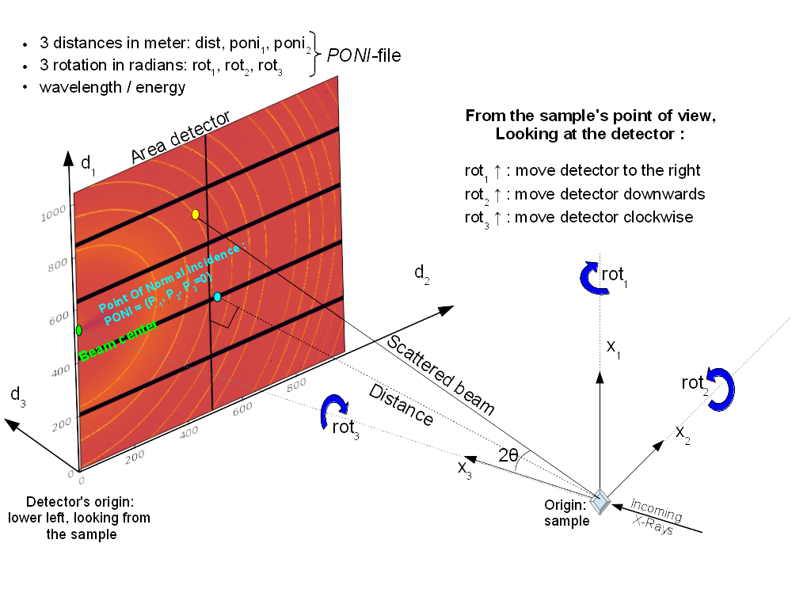

IMAGE TOOL
==========

.. _pyFAI: https://github.com/silx-kit/pyFAI
.. _imageio: https://github.com/imageio/imageio
.. _clipping: https://docs.scipy.org/doc/numpy/reference/generated/numpy.clip.html

The *ImageTool* window is the second control window which provides various image-related
information and controls.

Image control
-------------

.. image:: images/ImageTool.png
   :width: 800

+----------------------------+--------------------------------------------------------------------+
| Input                      | Description                                                        |
+============================+====================================================================+
| ``Update image``           | Manually update the current displayed image in the *ImageTool*     |
|                            | window. Disabled if *Update automatically* is checked.             |
+----------------------------+--------------------------------------------------------------------+
| ``Update automatically``   | Automatically update the current displayed image in the            |
|                            | *ImageTool* window.                                                |
+----------------------------+--------------------------------------------------------------------+
| ``Auto level``             | Update the detector images (not only in the *ImageTool* window,    |
|                            | but also in other plot windows) by automatically selecting levels  |
|                            | based on the maximum and minimum values in the data.               |
+----------------------------+--------------------------------------------------------------------+
| ``Threshold mask``         | An interval that pixel values outside the interval are set to 0.   |
|                            | Please distinguish *threshold mask* from clipping_.                |
+----------------------------+--------------------------------------------------------------------+
| ``Mask tile edges``        | Mask the edge pixel of each tile. *Only applicable for AGIPD, LPD  |
|                            | and DSSC if EXtra-foam is selected as the* ``Assembler`` *in*      |
|                            | :ref:`Geometry`.                                                   |
+----------------------------+--------------------------------------------------------------------+
| ``Save image``             | Save the current image to file. Please also see ImageFileFormat_   |
+----------------------------+--------------------------------------------------------------------+

Mask image
""""""""""

The action bar provides several actions for real-time masking operation. The pixel values in the
masked region will be set to 0.

+----------------------------+--------------------------------------------------------------------+
| Input                      | Description                                                        |
+============================+====================================================================+
| ``Mask``                   | Mask a rectangular region.                                         |
+----------------------------+--------------------------------------------------------------------+
| ``Unmask``                 | Remove mask in a rectangular region.                               |
+----------------------------+--------------------------------------------------------------------+
| ``Trash mask``             | Remove all the mask.                                               |
+----------------------------+--------------------------------------------------------------------+
| ``Save image mask``        | Save the current image mask in `.npy` format.                      |
+----------------------------+--------------------------------------------------------------------+
| ``Load image mask``        | Load a image mask in `.npy` format.                                |
+----------------------------+--------------------------------------------------------------------+

ROI manipulation
""""""""""""""""

You can activate (tick **On**) up to 4 ROIs at the same time. One can change the size
(**w**\idth, **h**\eight) and position (**x**\, **y**\) of an ROI by either dragging and moving
the ROI on the image or entering numbers. You can avoid modifying an ROI unwittingly by
**Lock**\ing it.

.. _ROI FOM setup:

ROI FOM setup
"""""""""""""

+----------------------------+--------------------------------------------------------------------+
| Input                      | Description                                                        |
+============================+====================================================================+
| ``Combo``                  | ROI combination, including *ROI1*, *ROI2*, *ROI1 + ROI2*,          |
|                            | *ROI1 - ROI2*, and *ROI1 / ROI2*.                                  |
+----------------------------+--------------------------------------------------------------------+
| ``FOM``                    | ROI FOM type, including *SUM*, *MEAN*, *MEDIAN*, *MIN*, *MAX*.     |
|                            | *STD*, *VAR*, *STD (norm)* and *VAR (norm)*.                       |
+----------------------------+--------------------------------------------------------------------+
| ``Norm``                   | Normalizer of ROI FOM. *Only applicable for train-resolved and     |
|                            | pump-probe analysis*.                                              |
+----------------------------+--------------------------------------------------------------------+
| ``Master-slave``           | Check to activate the *master-slave* model. This model is used     |
|                            | exclusively in correlation plots (see :ref:`statistics analysis`). |
|                            | When it is activated, FOMs of ROI1 (master) and ROI2 (slave) will  |
|                            | be plotted in the same correlation plot. For other statistics      |
|                            | analysis like binning and histogram, only ROI1 FOM will be used.   |
+----------------------------+--------------------------------------------------------------------+

- *STD (norm)* is defined as the ratio between the standard deviation and the mean.

- *VAR (norm)* is defined as the ratio between the variance and the square of the mean.

ROI histogram setup
"""""""""""""""""""

+----------------------------+--------------------------------------------------------------------+
| Input                      | Description                                                        |
+============================+====================================================================+
| ``Combo``                  | ROI combination, e.g. *ROI1*, *ROI2*, *ROI1 + ROI2*, *ROI1 - ROI2*.|
+----------------------------+--------------------------------------------------------------------+
| ``Bin range``              | Lower and upper boundaries of all the bins. In case of *+/- Inf*,  |
|                            | the boundary will be calculated dynamically.                       |
+----------------------------+--------------------------------------------------------------------+
| ``# of bins``              | Number of bins of the histogram.                                   |
+----------------------------+--------------------------------------------------------------------+

ROI normalizer setup
""""""""""""""""""""

+----------------------------+--------------------------------------------------------------------+
| Input                      | Description                                                        |
+============================+====================================================================+
| ``Combo``                  | ROI combination, e.g. *ROI3*, *ROI4*, *ROI3 + ROI4*, *ROI3 - ROI4*.|
+----------------------------+--------------------------------------------------------------------+
| ``FOM``                    | ROI FOM type, e.g. *SUM*, *MEAN*, *MEDIAN*, *MIN*, *MAX*.          |
+----------------------------+--------------------------------------------------------------------+

.. _ROI projection setup:

ROI projection setup
""""""""""""""""""""

Define the 1D projection of ROI (region of interest) analysis setup.

+----------------------------+--------------------------------------------------------------------+
| Input                      | Description                                                        |
+============================+====================================================================+
| ``Combo``                  | ROI combination, e.g. *ROI1*, *ROI2*, *ROI1 + ROI2*, *ROI1 - ROI2*.|
+----------------------------+--------------------------------------------------------------------+
| ``Direction``              | Direction of 1D projection (x or y).                               |
+----------------------------+--------------------------------------------------------------------+
| ``Norm``                   | Normalizer of the 1D-projection VFOM. *Only applicable for         |
|                            | train-resolved and pump-probe analysis*.                           |
+----------------------------+--------------------------------------------------------------------+
| ``AUC range``              | AUC (area under a curve) integration range.                        |
+----------------------------+--------------------------------------------------------------------+
| ``FOM range``              | Integration range when calculating the figure-of-merit of 1D       |
|                            | projection.                                                        |
+----------------------------+--------------------------------------------------------------------+

Gain / offset
-------------

.. _nanmean: https://docs.scipy.org/doc/numpy/reference/generated/numpy.nanmean.html

Apply pixel-wised gain and offset correction, where

.. math::

   A_{corrected} = (A_{raw} - I_{offset}) \cdot I_{gain}

Users can record a "dark run" whenever data is available. The dark run consists of a number
of trains. The moving average of the each "dark pulse" in the train will be calculated,
which will then be used to apply dark subtraction to image data pulse-by-pulse.

+----------------------------+--------------------------------------------------------------------+
| Input                      | Description                                                        |
+============================+====================================================================+
| ``Gain correction``        | Check to activate gain correction.                                 |
+----------------------------+--------------------------------------------------------------------+
| ``Offset correction``      | Check to activate offset correction.                               |
+----------------------------+--------------------------------------------------------------------+
| ``Use dark as offset``     | Check to use recorded dark images as offset. The already loaded    |
|                            | offset constants will be ignored.                                  |
+----------------------------+--------------------------------------------------------------------+
| ``Record dark``            | Start and stop dark run recording.                                 |
+----------------------------+--------------------------------------------------------------------+
| ``Remove dark``            | Remove the recorded dark run.                                      |
+----------------------------+--------------------------------------------------------------------+

.. Note::

    The moving average here is not calculated by nanmean_, which means that if a pixel of the image
    in a certain pulse is *NaN*, the moving average of that pixel will be *NaN* for that pulse.

Reference image
---------------

+------------------------------+--------------------------------------------------------------------+
| Input                        | Description                                                        |
+==============================+====================================================================+
| ``Load reference``           | Load a reference image from file. Please also see ImageFileFormat_ |
+------------------------------+--------------------------------------------------------------------+
| ``Set current as reference`` | Set the current displayed image as a reference image. For now,     |
|                              | reference image is used as a stationary off-image in the           |
|                              | *predefined off* mode in *pump-probe* analysis.                    |
+------------------------------+--------------------------------------------------------------------+
| ``Remove reference``         | Remove the reference image.                                        |
+------------------------------+--------------------------------------------------------------------+

.. _ImageFileFormat:

.. Note:: Image file format

    The two recommended image file formats are `.npy` and `.tif`. However,
    depending on the OS, the opened file dialog may allow you to enter any filename.
    Therefore, in principle, users can save and load any other image file formats
    supported by imageio_. However, it can be wrong if one writes and then loads a
    `.png` file due to the auto scaling of pixel values.

Azimuthal integration 1D
------------------------

.. _pyFAI: https://github.com/silx-kit/pyFAI

**EXtra-foam** uses pyFAI_ to do azimuthal integration. As illustrated in the sketch below,
the **origin** is located at the sample position, more precisely, where the X-ray beam crosses
the main axis of the diffractometer. The detector is treated as a rigid body, and its position
in space is described by six parameters: 3 translations and 3 rotations. The orthogonal
projection of **origin** on the detector surface is called **PONI** (Point Of Normal Incidence).
For non-planar detectors, **PONI** is defined in the plan with z=0 in the detector’s coordinate
system. It is worth noting that usually **PONI** is not the beam center on the detector surface.

The input parameters *Cx* and *Cy* correspond to *Poni2* and *Poni1* in the
aforementioned coordinate system, respectively.

.. image:: images/azimuthal_integ_1D.png
   :width: 800

+----------------------------+--------------------------------------------------------------------+
| Input                      | Description                                                        |
+============================+====================================================================+
| ``Cx (pixel)``             | Coordinate of the point of normal incidence along the detector's   |
|                            | 2nd dimension.                                                     |
+----------------------------+--------------------------------------------------------------------+
| ``Cy (pixel)``             | Coordinate of the point of normal incidence along the detector's   |
|                            | 1st dimension.                                                     |
+----------------------------+--------------------------------------------------------------------+
| ``Pixel x (m)``            | Pixel size along the detector's 2nd dimension.                     |
+----------------------------+--------------------------------------------------------------------+
| ``Pixel y (m)``            | Pixel size along the detector's 1st dimension.                     |
+----------------------------+--------------------------------------------------------------------+
| ``Sample distance``        | Sample-detector distance in m. Only used in azimuthal integration. |
+----------------------------+--------------------------------------------------------------------+
| ``Rotation x (rad)``       | *Not used*                                                         |
+----------------------------+--------------------------------------------------------------------+
| ``Rotation y (rad)``       | *Not used*                                                         |
+----------------------------+--------------------------------------------------------------------+
| ``Rotation z (rad)``       | *Not used*                                                         |
+----------------------------+--------------------------------------------------------------------+
| ``Photon energy (keV)``    | Photon energy in keV. Only used in azimuthal integration for now.  |
+----------------------------+--------------------------------------------------------------------+
| ``Integ method``           | Azimuthal integration methods provided by pyFAI_.                  |
+----------------------------+--------------------------------------------------------------------+
| ``Integ points``           | Number of points in the output pattern of azimuthal integration.   |
+----------------------------+--------------------------------------------------------------------+
| ``Integ range (1/A)``      | Azimuthal integration range.                                       |
+----------------------------+--------------------------------------------------------------------+
| ``Norm``                   | Normalizer of the scattering curve. *Only applicable for           |
|                            | train-resolved and pump-probe analysis*.                           |
+----------------------------+--------------------------------------------------------------------+
| ``AUC range (1/A)``        | AUC (area under curve) range.                                      |
+----------------------------+--------------------------------------------------------------------+
| ``FOM range (1/A)``        | Integration range when calculating the figure-of-merit of the      |
|                            | azimuthal integration result.                                      |
+----------------------------+--------------------------------------------------------------------+

.. _Geometry:

Geometry
--------

.. _EXtra-geom : https://github.com/European-XFEL/EXtra-geom

Geometry is only available for the multi-module detector which requires a geometry file to
assemble the images from different modules, for example, AGIPD, LPD and DSSC. For details
about geometries of those detectors, please refer to the
`documentation <https://extra-geom.readthedocs.io/en/latest/geometry.html>`_.

.. image:: images/geometry.png
   :width: 640

+----------------------------+--------------------------------------------------------------------+
| Input                      | Description                                                        |
+============================+====================================================================+
| ``Quadrant positions``     | The first pixel of the first module in each quadrant,              |
|                            | corresponding to data channels 0, 4, 8 and 12.                     |
+----------------------------+--------------------------------------------------------------------+
| ``Load geometry file``     | Open a *FileDialog* window to choose a geometry file from the      |
|                            | local file system.                                                 |
+----------------------------+--------------------------------------------------------------------+
| ``Assembler``              | There are two assemblers available in *EXtra-foam*. One is         |
|                            | EXtra-geom_ implemented in Python and the other is the local C++   |
|                            | implementation. Indeed, the latter follows the assembling          |
|                            | methodology implemented in the former but is much faster with      |
|                            | multi-core processors.                                             |
+----------------------------+--------------------------------------------------------------------+
| ``Stack only``             | When the checkbox is checked, the modules will be seamlessly       |
|                            | stacked together. Unfortunately, it does not mean that this will   |
|                            | be faster than assembling with a geometry. It simply provides an   |
|                            | alternative to check the data from different modules.              |
+----------------------------+--------------------------------------------------------------------+
