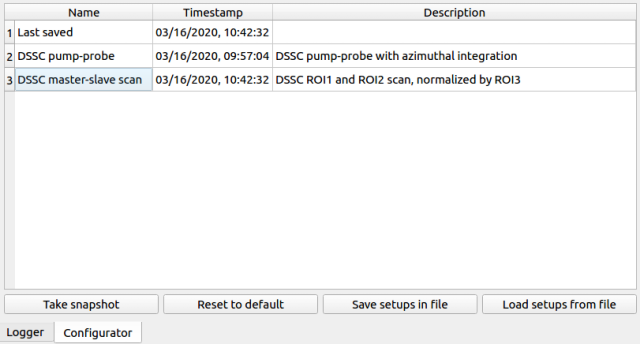

MAIN GUI
========

The main GUI of **EXtra-foam** is divided into several control panels grouped
by functionality and a log window.

.. image:: images/MainGUI.png
   :width: 800

Data source
-----------

**EXtra-foam** supports different kind of data flow. Unless you are very familiar with the
**EXtra-foam** and Karabo, it is recommended to use the scenario 1 depicted in :ref:`data flow`.
Namely, only one connection should be checked.

+----------------------------+--------------------------------------------------------------------+
| Input                      | Description                                                        |
+============================+====================================================================+
| ``Source type``            | Receiving the data from                                            |
|                            |                                                                    |
|                            | - *ZeroMQ bridge*: mainly used for real-time analysis. The data    |
|                            |   will be sent from a *PipeToZeroMQ* Karabo device;                |
|                            |                                                                    |
|                            | - *run directory*: used for replaying the experiment.              |
+----------------------------+--------------------------------------------------------------------+
| ``IP address``             | IP address of the TCP connection.                                  |
+----------------------------+--------------------------------------------------------------------+
| ``Port``                   | Port number of the TCP connection.                                 |
+----------------------------+--------------------------------------------------------------------+

.. image:: images/data_source_tree.png
   :width: 640

In the data source tree, one can select which source items (a source item is defined by both the
*Source name* and *Property*) are required in the analysis. The available sources are monitored
and displayed in the *Available sources* widget below. However, for properties, you will need some
instrument-domain knowledge. Users are not allowed to add/remove source items to/from the tree during
the run time, however, they can be configured via :ref:`config file`. Nevertheless, one can still
make use of "User-defined" source to define a control data source item dynamically.

For each data source item, one can also set up the following attribute when applicable.

+----------------------------+--------------------------------------------------------------------+
| Input                      | Description                                                        |
+============================+====================================================================+
| ``Pulse slicer``           | The input will be used to construct a *slice* object in Python     |
|                            | which is used to select the specified pulse pattern in a train     |
|                            | from a pipeline data.                                              |
+----------------------------+--------------------------------------------------------------------+
| ``Value range``            | Value range filter of the corresponding source. When it applies to |
|                            | pipeline data, it will apply data filtering pulse-by-pulse. When   |
|                            | it applies to control data, it will then apply data filtering      |
|                            | train-by-train. *Not all pipeline data support it*                 |
+----------------------------+--------------------------------------------------------------------+

.. Note::

    One can modify a data source item only when it is checked.

General analysis
----------------

Global setup
""""""""""""

Define analysis parameters used globally.

+----------------------------+--------------------------------------------------------------------+
| Input                      | Description                                                        |
+============================+====================================================================+
| ``POI indices``            | Indices of the pulse of interest (POI) 1 and 2. It is used for     |
|                            | visualizing a single image in the *Pulse-of-interest* window. **If |
|                            | 'Pulse slicer' is used to slice a portion of the pulses in the     |
|                            | train, this index is indeed the index of the pulse in the sliced   |
|                            | train**. *Pulse-resolved detector only.*                           |
+----------------------------+--------------------------------------------------------------------+
| ``Moving average window``  | Moving average window size. If the moving average window size is   |
|                            | larger than 1, moving average will be applied to all the           |
|                            | registered analysis types. If the new window size is smaller than  |
|                            | the old one, the moving average calculation will start from the    |
|                            | scratch.                                                           |
+----------------------------+--------------------------------------------------------------------+
| ``Reset``                  | Reset the moving average counts of all registered analysis types.  |
+----------------------------+--------------------------------------------------------------------+

Pump-probe setup
""""""""""""""""

See :ref:`Pump-probe analysis`

Pulse filter setup
""""""""""""""""""

Apply data reduction by setting the lower and upper boundary of the specified FOM. Currently,
it affects calculating the average of images in a train as well as the averages of images of
ON-/Off- pulses in a train

+----------------------------+--------------------------------------------------------------------+
| Input                      | Description                                                        |
+============================+====================================================================+
| ``Analysis type``          | See :ref:`Analysis type`.                                          |
+----------------------------+--------------------------------------------------------------------+
| ``FOM range``              | Number of bins of the histogram.                                   |
+----------------------------+--------------------------------------------------------------------+
| ``pulse resolved``         | This checkbox is only enabled for the pulse-resolved detectors.    |
|                            | When it is checked, the filtering is pulse-wise. Otherwise, the    |
|                            | filtering is train-wise.                                           |
+----------------------------+--------------------------------------------------------------------+

Statistics analysis
-------------------

See :ref:`statistics analysis`

Configurator
------------

*Configurator* is a new feature introduced in version 0.8.1, it allows users to save and load
different analysis setups (a snapshot in the Redis database) conveniently. To apply a setup,
simply **double-click** the name of the snapshot listed in the table. Please distinguish it
from :ref:`config file`, which is mainly used for data source management. Due to the historical
reason, some setups in the :ref:`config file` can also be saved and loaded via the configurator,
like ``photon energy``, ``sample distance``, etc. :ref:`config file` defines the default setups
which will be overwritten when a setup snapshot is applied. The default setups can be recovered by
clicking the ``Reset to default`` button.

+----------------------------+--------------------------------------------------------------------+
| Input                      | Description                                                        |
+============================+====================================================================+
| ``Take snapshot``          | Take a snapshot of the current setup and store in ``Last saved``.  |
+----------------------------+--------------------------------------------------------------------+
| ``Reset to default``       | Reset the current setup to default. ``Last saved`` will not be     |
|                            | affected.                                                          |
+----------------------------+--------------------------------------------------------------------+
| ``Save setups in file``    | Save all the snapshots listed in the table to file. All the        |
|                            | snapshots in the setup file will be lost.                          |
+----------------------------+--------------------------------------------------------------------+
| ``Load setups from file``  | Load all the snapshots from file. In case of name conflict, the    |
|                            | listed snapshot in the table will be overwritten.                  |
+----------------------------+--------------------------------------------------------------------+

When right-clicking the name of a snapshot, a menu will show up:

+----------------------------+--------------------------------------------------------------------+
| Input                      | Description                                                        |
+============================+====================================================================+
| ``Copy snapshot``          | Make a copy of the snapshot.                                       |
+----------------------------+--------------------------------------------------------------------+
| ``Delete snapshot``        | Delete the snapshot.                                               |
+----------------------------+--------------------------------------------------------------------+
| ``Rename snapshot``        | Rename the snapshot.                                               |
+----------------------------+--------------------------------------------------------------------+

.. warning::

    *Configurator* is still in the testing phase and we are collecting feedbacks from users.
    It should be noted that there is no backup recovery mechanism for now.
