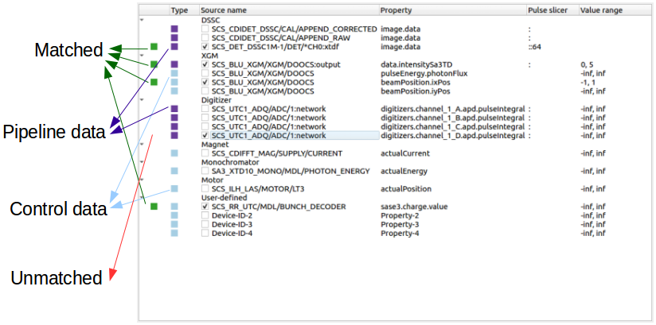

.. _Main_GUI:

Main GUI
========

The main GUI of **EXtra-foam** is divided into several control panels grouped
by functionality and a log window.

Action bar
----------

- **Start**

  Start acquiring, processing and visualizing data.

- **Stop**

  Stop acquiring and processing data.

- **Image tool**

  Open the :ref:`Image tool` for image related manipulation and analysis.

- **Pulse-of-interest**

  Open the window for monitoring up to two pulses of interest.
  *Only available for pulse-resolved detectors*

- **Pump-probe**

  Open the window for :ref:`Pump-probe analysis`.

- **Correlation**

  Open the window for :ref:`Correlation` analysis.

- **Histogram**

  Open the window for :ref:`Histogram` analysis.

- **Binning**

  Open the window for :ref:`Binning` analysis.

- **File stream**

  Open the window for :ref:`stream data from run directory`.

- **About**

.. _Data source:

Data source
-----------

Bridge client connections
"""""""""""""""""""""""""

**EXtra-foam** supports different kind of data flow. Unless you are very familiar with the
**EXtra-foam** and Karabo, it is recommended to use the scenario 1 depicted in :ref:`data flow`.
Namely, only one connection should be checked.

+----------------------------+--------------------------------------------------------------------+
| Input                      | Description                                                        |
+============================+====================================================================+
| ``Source type``            | Receiving the data from                                            |
|                            |                                                                    |
|                            | - *ZeroMQ bridge*: mainly used for real-time analysis. The data    |
|                            |   will be sent from a *PipeToZeroMQ* Karabo device;                |
|                            |                                                                    |
|                            | - *run directory*: used for replaying the experiment.              |
+----------------------------+--------------------------------------------------------------------+
| ``IP address``             | IP address of the TCP connection.                                  |
+----------------------------+--------------------------------------------------------------------+
| ``Port``                   | Port number of the TCP connection.                                 |
+----------------------------+--------------------------------------------------------------------+

.. _Data source tree:

Data source tree
""""""""""""""""

In the data source tree, one can select which data source items (the ID of a data source item is
defined by both the *Source name* and the *Property*) are required in the analysis. Data source
items can be configured via :ref:`config file`. Users are not allowed to add/delete data source
items in the GUI, i.e. add or delete rows in the tree. Alternatively, users can modify an existing
data source item *when it is checked*.

When a data source item is checked and is matched (found together with other data source items
with the same train ID), the indicator on the first column of the tree will turn green. The indicator
will turn red if the data source item is not able to be matched for a while or it is unchecked.

+----------------------------+--------------------------------------------------------------------+
| Input                      | Description                                                        |
+============================+====================================================================+
| ``Type``                   | Pipeline data or control data.                                     |
+----------------------------+--------------------------------------------------------------------+
| ``Source name``            | Karabo device or output channel name                               |
+----------------------------+--------------------------------------------------------------------+
| ``Property``               | Property of the given device or output channel                     |
+----------------------------+--------------------------------------------------------------------+
| ``Pulse slicer``           | The input will be used to construct a *slice* object in Python     |
|                            | which is used to select the specified pulse pattern in a train     |
|                            | from a pipeline data.                                              |
+----------------------------+--------------------------------------------------------------------+
| ``Value range``            | Value range filter of the corresponding source. When it applies to |
|                            | a pipeline data, it will apply data filtering pulse-by-pulse. When |
|                            | it applies to a control data, it will then apply data filtering    |
|                            | train-by-train. *Not all pipeline data support it*                 |
+----------------------------+--------------------------------------------------------------------+

Source monitor
""""""""""""""

Source monitor is used to display sources names (Karabo device and output channel) received by the Karabo
bridge client. Different from the (match/unmatched) indicator in the data source tree, it also shows
sources which do not exist in the data source tree. When a modular source (e.g. DSSC data) is selected
and matched, it displays individual names of the received modules. However, the source monitor does
not show property names for speed, as a Karabo device can have dozens of control data. The property
names of a Karabo device or an output channel can be found in the Karabo GUI when you are performing
online analysis in the hutch, or in the :ref:`File streamer` when you are streaming data from files.

.. note::

    The Karabo bridge client will only start to receive data when the green `Start bridge` button is
    checked and the data source item of the main detector is selected.

General analysis
----------------

.. _Global setup:

Global setup
""""""""""""

Define analysis parameters used globally.

+----------------------------+--------------------------------------------------------------------+
| Input                      | Description                                                        |
+============================+====================================================================+
| ``POI indices``            | Indices of the pulse of interest (POI) 1 and 2. It is used for     |
|                            | visualizing a single image in the *Pulse-of-interest* window. **If |
|                            | 'Pulse slicer' is used to slice a portion of the pulses in the     |
|                            | train, this index is indeed the index of the pulse in the sliced   |
|                            | train**. *Pulse-resolved detector only.*                           |
+----------------------------+--------------------------------------------------------------------+
| ``Moving average window``  | Moving average window size. If the moving average window size is   |
|                            | larger than 1, moving average will be applied to all the           |
|                            | registered analysis types. If a new window size is smaller than    |
|                            | the old one, the moving average calculation will start from the    |
|                            | scratch. Currently, this setup will affect the calculations of:    |
|                            |                                                                    |
|                            | - Pulse intensity of XGM                                           |
|                            | - Pulse integral of Digitizer                                      |
|                            | - Train-resolved (pump/probe) azimuthal integration                |
|                            | - Train-resolved (pump/probe) ROI FOM                              |
|                            | - Train-resolved (pump/probe) ROI 1D projection                    |
|                            |                                                                    |
+----------------------------+--------------------------------------------------------------------+
| ``Reset``                  | Reset the moving average counts of all registered analysis types.  |
+----------------------------+--------------------------------------------------------------------+

.. Warning::

    Since version 1.10, another moving average was re-activated in :ref:`Image tool`. If both the
    moving averages are set, the result of azimuthal integration, ROI FOM and ROI 1D projection
    will be a moving average on top of the moving averaged image! This is due to some historical
    reason and it will be fixed in the future.

Pump-probe setup
""""""""""""""""

See :ref:`Pump-probe analysis`

Pulse filter setup
""""""""""""""""""

Apply data reduction by setting the lower and upper boundary of the specified FOM. Currently,
it affects calculating the average of images in a train as well as the averages of images of
ON-/Off- pulses in a train

+----------------------------+--------------------------------------------------------------------+
| Input                      | Description                                                        |
+============================+====================================================================+
| ``Analysis type``          | See :ref:`Analysis type`.                                          |
+----------------------------+--------------------------------------------------------------------+
| ``FOM range``              | Number of bins of the histogram.                                   |
+----------------------------+--------------------------------------------------------------------+
| ``pulse resolved``         | This checkbox is only enabled for the pulse-resolved detectors.    |
|                            | When it is checked, the filtering is pulse-wise. Otherwise, the    |
|                            | filtering is train-wise.                                           |
+----------------------------+--------------------------------------------------------------------+

Analysis setup manager
----------------------

*Analysis setup manager* is a new feature introduced in version 0.8.1, it allows users to save and load
different analysis setups (a snapshot in the Redis database) conveniently. To apply a setup,
simply **double-click** the name of the setup listed in the table. Please distinguish it
from :ref:`config file`, which is mainly used for data source management. Due to the historical
reason, some setups in the :ref:`config file` can also be saved and loaded via the *Analysis setup manager*,
like ``photon energy``, ``sample distance``, etc. :ref:`config file` defines the default setups
which will be overwritten when a setup in the *Analysis setup manager* is applied. The default setups
can be recovered by clicking the ``Reset to default`` button.

+----------------------------+--------------------------------------------------------------------+
| Input                      | Description                                                        |
+============================+====================================================================+
| ``Take snapshot``          | Take a snapshot of the current parameters and store them in        |
|                            | ``Last saved``.                                                    |
+----------------------------+--------------------------------------------------------------------+
| ``Reset to default``       | Reset the current parameters to default. ``Last saved`` will not   |
|                            | be affected.                                                       |
+----------------------------+--------------------------------------------------------------------+
| ``Save all to file``       | Save all the setups listed in the table to file. The data          |
|                            | in the setup file will be overwritten.                             |
+----------------------------+--------------------------------------------------------------------+
| ``Load from file``         | Load setups from file. In case of name conflict, the               |
|                            | listed setups in the table will be overwritten.                    |
+----------------------------+--------------------------------------------------------------------+

When right-clicking the name of a snapshot, a context menu will show up:

.. image:: images/analysis_setup_manager_context_menu.png

+----------------------------+--------------------------------------------------------------------+
| Input                      | Description                                                        |
+============================+====================================================================+
| ``Take snapshot``          | Take a snapshot of the parameters and store them in both the       |
|                            | ``Last saved`` and the selected analysis setups.                   |
+----------------------------+--------------------------------------------------------------------+
| ``Copy``                   | Make a copy of the selected analysis setup.                        |
+----------------------------+--------------------------------------------------------------------+
| ``Delete``                 | Delete the selected analysis setup.                                |
+----------------------------+--------------------------------------------------------------------+
| ``Rename``                 | Rename the selected analysis setup.                                |
+----------------------------+--------------------------------------------------------------------+

.. warning::

    *Analysis setup manager* is still in the testing phase and we are collecting feedbacks from users.
    It should be noted that there is no backup recovery mechanism for now.

Extensions
-----------

On the left hand side there is a tab bar, one for the main GUI and the second
for the extensions settings:

EXtra-foam supports streaming the processed data in two ways:

1. All processed data may be streamed to a :ref:`Special analysis suite`.
2. Just the processed and averaged detector image may be streamed over a Karabo
   bridge. This is could be helpful if, for example, an experiment requires using
   two detectors simultaneously. In this case EXtra-foam could be set up to read
   data from both a trainmatcher/Karabo bridge hosted in Karabo and another
   EXtra-foam instance. To get the detector data from a Karabo bridge client,
   use the key ``EF_<source_name>``, where ``source_name`` is the source name of the
   main detector. For example, if streaming ePix data from the device
   ``MID_EXP_EPIX-2/DET/RECEIVER:output`` with property ``data.image``, use
   ``EF_MID_EXP_EPIX-2/DET/RECEIVER:output`` and ``data.image`` at the client.

.. warning::

    There are limited use-cases for streaming detector data to another
    EXtra-foam instance, contact da-support@xfel.eu if you would like to do
    this.

+-----------------------------+--------------------------------------------------------------------+
| Input                       | Description                                                        |
+=============================+====================================================================+
| ``Special suite port``      | Port to use for streaming data for the special suites.             |
+-----------------------------+--------------------------------------------------------------------+
| ``Detector streaming port`` | Port to use for streaming the processed 2D detector image.         |
+-----------------------------+--------------------------------------------------------------------+
