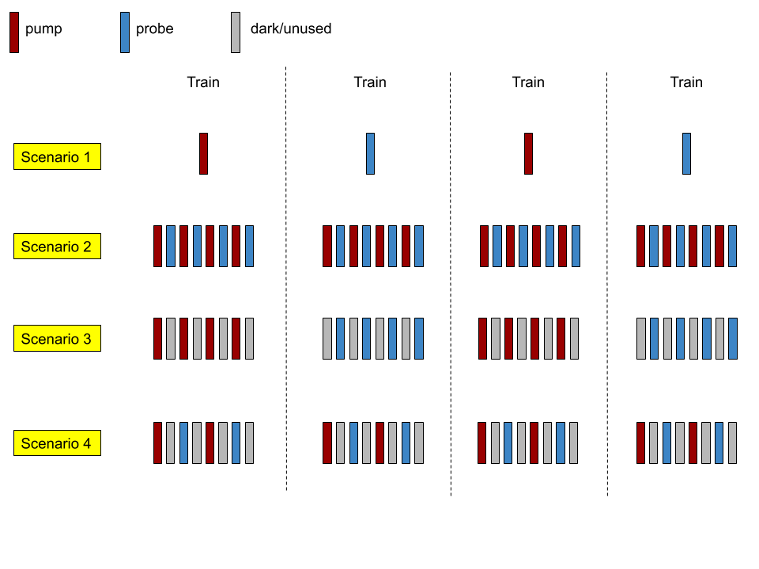
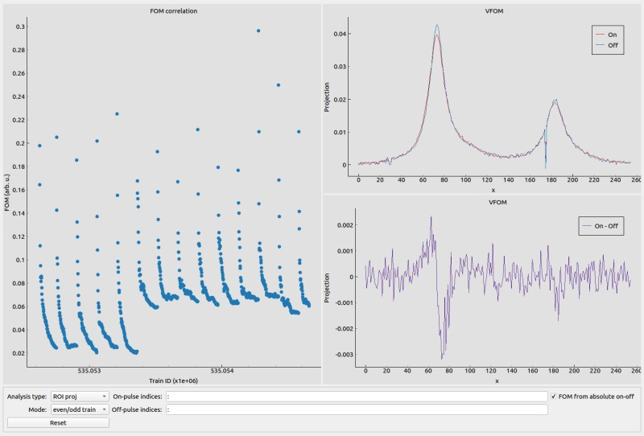

.. _Pump-probe analysis:

Pump-probe analysis
===================

.. _nanmean: https://docs.scipy.org/doc/numpy/reference/generated/numpy.nanmean.html

In the *pump-probe* analysis, the average (nanmean_) images of the on- and off- pulses
in a train are calculated by

.. math::

   \bar{A}_{on} = \Sigma A_{on} / N_{on}

   \bar{A}_{off} = \Sigma A_{off} / N_{off}.

If the sub-:ref:`Analysis type` has VFOM, the VFOM :math:`K_v` and FOM :math:`K` are
given by

.. math::

   K_v = f(\bar{A}_{on}) - f(\bar{A}_{off})

   K = \Sigma K_v.

Otherwise, FOM :math:`K` is given by

.. math::

   K = g(\bar{A}_{on}) - g(\bar{A}_{off}).

+------------------------------+--------------------------------------------------------------------+
| Input                        | Description                                                        |
+==============================+====================================================================+
| ``On/off mode``              | Pump-probe analysis mode:                                          |
|                              |                                                                    |
|                              | - ``reference as off``:                                            |
|                              |                                                                    |
|                              |   On-pulses will be taken from each train while the 'off'          |
|                              |   (reference image) is specified in the ImageTool.                 |
|                              |                                                                    |
|                              | - ``same train``:                                                  |
|                              |                                                                    |
|                              |   On-pulses and off-pulses will be taken from the same train. Not  |
|                              |   applicable to train-resolved detectors.                          |
|                              |                                                                    |
|                              | - ``even\/odd``:                                                   |
|                              |                                                                    |
|                              |   On-pulses will be taken from trains with even train IDs while    |
|                              |   off-pulses will be taken from trains with odd train IDs.         |
|                              |                                                                    |
|                              | - ``odd\/even``:                                                   |
|                              |                                                                    |
|                              |   On-pulses will be taken from trains with odd train IDs while     |
|                              |   off-pulses will be taken from trains with even train IDs.        |
+------------------------------+--------------------------------------------------------------------+
| ``Analysis type``            | See :ref:`Analysis type`.                                          |
+------------------------------+--------------------------------------------------------------------+
| ``On-pulse indices``         | Indices of all on-pulses. **If 'Pulse slicer' is used to slice a   |
|                              | portion of the pulses in the train, these indices are indeed the   |
|                              | indices of the pulse in the sliced train**.                        |
|                              | *Pulse-resolved detector only.*                                    |
+------------------------------+--------------------------------------------------------------------+
| ``Off-pulse indices``        | Indices of all off-pulses. *Pulse-resolved detector only.*         |
+------------------------------+--------------------------------------------------------------------+
| ``FOM from absolute on-off`` | If this checkbox is ticked, the FOM will be calculated based on    |
|                              | `\|on - off\|` (default). Otherwise `on - off`.                    |
+------------------------------+--------------------------------------------------------------------+
| ``Reset``                    | Reset the FOM plot in the *Pump-probe window* and the global       |
|                              | moving average count.                                              |
+------------------------------+--------------------------------------------------------------------+

