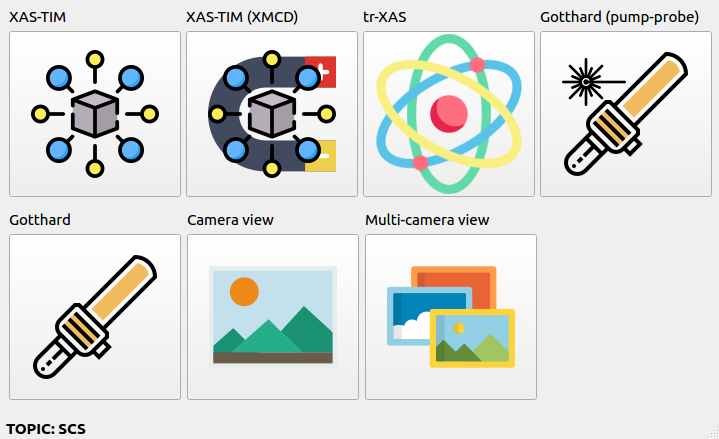
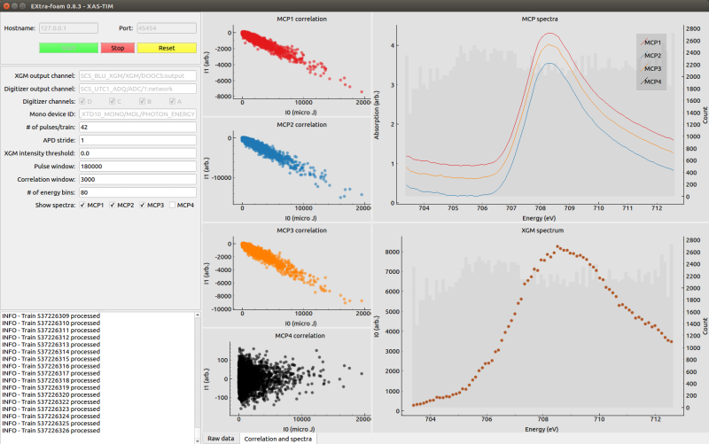
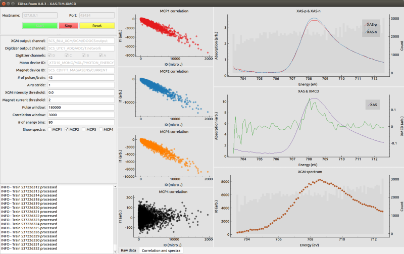

SPECIAL ANALYSIS SUITE
======================

Introduction
------------

Special analysis suite is a new concept introduced in the version 0.8.2 to solve some issues which cannot
be addressed in EXtra-foam core. Each suite is a group of applications (we will call it *app* in the rest
part of this documentation) dedicated for specific online analysis. The following table compares
EXtra-foam core and special suite in various aspects.

+------------------------------------------------+--------------------------------------------------+
| EXtra-foam core                                | EXtra-foam special suite                         |
+================================================+==================================================+
| General purpose; rich features.                | Special purpose.                                 |
+------------------------------------------------+--------------------------------------------------+
| Image detector oriented.                       | Any detector.                                    |
+------------------------------------------------+--------------------------------------------------+
| One instance per detector per cluster.         | **No restriction on number of instances.**       |
+------------------------------------------------+--------------------------------------------------+
| GUI performance degrades with a lot of plots.  | **Limited plots per app. GUI update rate can**   |
|                                                | **reach 10 Hz in most cases.**                   |
+------------------------------------------------+--------------------------------------------------+
| Complicated.                                   | Easy to implement.                               |
+------------------------------------------------+--------------------------------------------------+
| Multi-process; distributed.                    | Single-process; multi-threading.                 |
+------------------------------------------------+--------------------------------------------------+
| Python and C++.                                | Pure Python but depends on EXtra-foam core.      |
+------------------------------------------------+--------------------------------------------------+

There are two different work flows for special analysis:

1. The special analysis will receive processed data from a main **EXtra-foam** instance;
2. The special analysis is independent from the main instance and it directly receives
   data from a "Karabo bridge".

The first work flow can be deemed as an extension to **EXtra-foam** core, while the second one
is indeed similar to a mini **karaboFAI** prior to version 0.4.7.

The special analysis suite can be started by typing

.. code-block:: bash

    extra-foam-special-suite TOPIC

in a terminal. Depending on the topic, you will see a facade window like

Click one of the app icons and the analysis window will show up and the facade will be
closed. If one needs two instances of the same app, one can simply repeat the process.
Apps in special suite can be further categorized into special-purposed (e.g.
XAS-TIM, tr-XAS) and general purposed (e.g. Camera view, multi-camera view) apps. General
purposed apps will appear in any topic while special-purposed apps will only appear in
certain topics. Moreover, the same special-purposed app may behave differently in
different topics. Namely, they are really customized for topics.

General purposed apps
---------------------

Camera view, multi-camera view

Special purposed apps
---------------------

- SPB

Gotthard

- FXE

Bragg diffraction peak, XES

- SCS

Gotthard, Gotthard (pump-probe), :ref:`XAS-TIM`, :ref:`XAS-TIM-XMCD`, tr-XAS

- MID

Gotthard

- HED

- DET

Multi-module scan

- XPD

Gotthard

.. _XAS-TIM:

XAS-TIM
"""""""

.. _XAS-TIM-XMCD:

XAS-TIM-XMCD
""""""""""""

