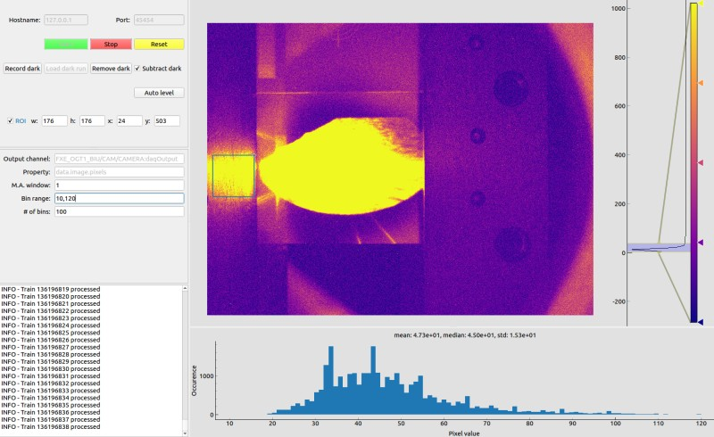
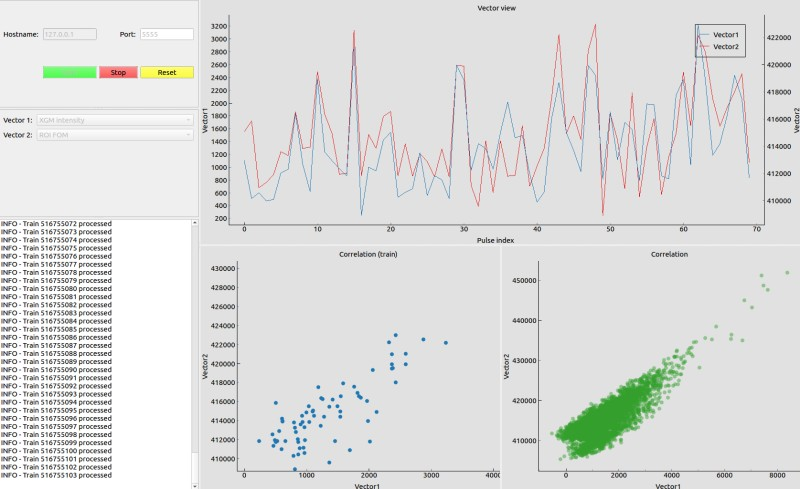
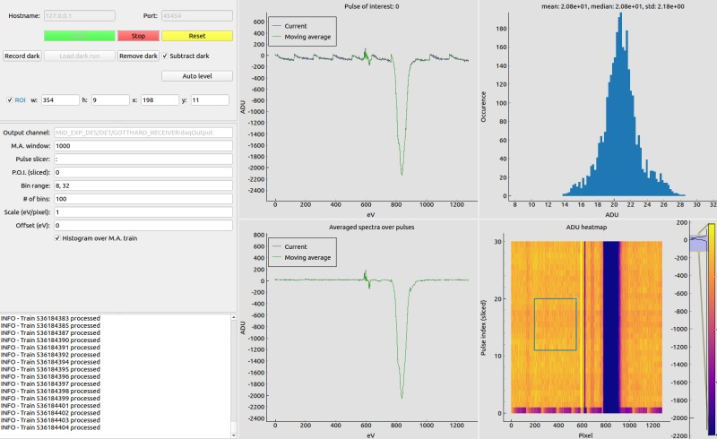
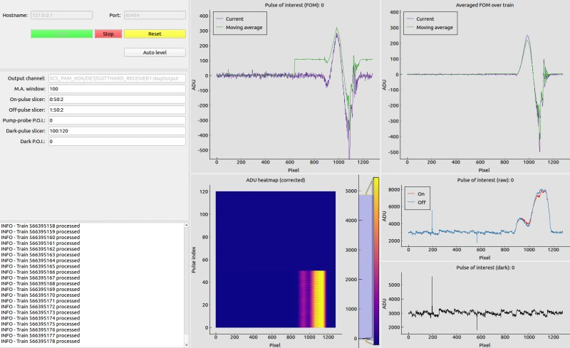
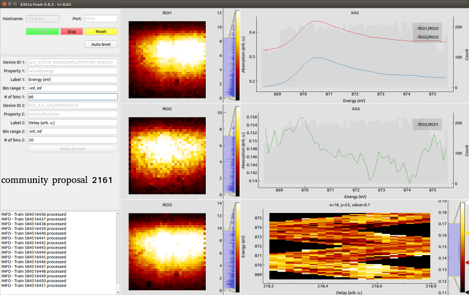

.. _special analysis suite:

Special analysis suites
=======================

Introduction
------------

Special analysis suite is a new concept introduced in the version 0.8.2 to solve some issues which cannot
be addressed in EXtra-foam core. Each suite is a group of applications (we will call it *app* in the rest
part of this documentation) dedicated for specific online analysis. The following table compares
EXtra-foam core and special suite in various aspects.

+------------------------------------------------+--------------------------------------------------+
| EXtra-foam core                                | EXtra-foam special suite                         |
+================================================+==================================================+
| General purpose; rich features.                | Special-purposed small apps.                     |
+------------------------------------------------+--------------------------------------------------+
| **Heavy computation.**                         | Light computation.                               |
+------------------------------------------------+--------------------------------------------------+
| Image detector oriented.                       | Any detector.                                    |
+------------------------------------------------+--------------------------------------------------+
| One instance per detector per cluster.         | **No restriction on number of instances.**       |
+------------------------------------------------+--------------------------------------------------+
| GUI performance degrades with a lot of plots.  | **Limited plots per app. GUI update rate can**   |
|                                                | **reach 10 Hz in most cases.**                   |
+------------------------------------------------+--------------------------------------------------+
| Complicated.                                   | Easy to implement.                               |
+------------------------------------------------+--------------------------------------------------+
| Multi-process; distributed.                    | Single-process; multi-threading.                 |
+------------------------------------------------+--------------------------------------------------+
| Python and C++.                                | Pure Python.                                     |
+------------------------------------------------+--------------------------------------------------+
|                                                | Depends on EXtra-foam core; may need a core      |
|                                                | instance to run.                                 |
+------------------------------------------------+--------------------------------------------------+

There are two different work flows for special analysis:

1. The special analysis receives processed data from a main **EXtra-foam** instance;
2. The special analysis is independent from the main instance and it directly receives
   data from a "Karabo bridge".

The first work flow can be deemed as an extension to **EXtra-foam** core, while the second one
is indeed similar to a mini **karaboFAI** prior to version 0.4.7.

The special analysis suite can be started by typing

.. code-block:: bash

    extra-foam-special-suite TOPIC

in a terminal. Depending on the topic, you will see a facade window like

.. image:: images/special_suite_facade_scs.png

Click one of the app icons and the analysis window will show up and the facade will be
closed. If one needs two instances of the same app, one can simply repeat the process.
Apps in special suite can be further categorized into special-purposed (e.g.
XAS-TIM, tr-XAS) and general purposed (e.g. Camera view, multi-camera view) apps. General
purposed apps will appear in any topic while special-purposed apps will only appear in
certain topics. Moreover, the same special-purposed app may behave differently in
different topics. Namely, they are really customized for topics.

More info on command line arguments can be obtained as

.. code-block:: console

   [user@exflonc12 ~]$ extra-foam-special-suite --help

    usage: extra-foam-special-suite [-h] [-V] [--use-gate] [--debug]
                                    {SPB,FXE,SCS,SQS,MID,HED,DET}

    positional arguments:
      {SPB,FXE,SCS,SQS,MID,HED,DET}
                            Name of the topic

    optional arguments:
      -h, --help            show this help message and exit
      -V, --version         show program's version number and exit
      --use-gate            Use Karabo gate client (experimental feature)
      --debug               Run in debug mode

.. note::
    *Karabo gate* is an experimental feature which will allow users to request data
    within **EXtra-foam**. Namely, one does not need to config the required data in
    a *PipeToZeroMQ* device or a *TrainMatcher* device. For more details, please
    contact the data analysis group.

General purposed apps
---------------------

:ref:`Camera view`, :ref:`Vector view`, multi-camera view

.. _Camera view:

Camera view
"""""""""""

Camera view is a light-weight image tool for monitoring image data updated at 10 Hz or even faster.
It also allows to monitor (ROI) histogram of the image. When the ROI is activated, histogram is
calculated over the ROI instead of the whole image. It supports any train-resolved image data, i.e.
an image data which has a shape of (y, x) or (1, y, x) or (y, x, 1).

More small features will be added in the future.

+----------------------------+--------------------------------------------------------------------+
| Input                      | Description                                                        |
+============================+====================================================================+
| ``Output channel``         | Output channel name.                                               |
+----------------------------+--------------------------------------------------------------------+
| ``Property``               | Image data property name.                                          |
+----------------------------+--------------------------------------------------------------------+
| ``M.A. window``            | Slicer used to slice pulses in a train.                            |
+----------------------------+--------------------------------------------------------------------+
| ``Bin range``              | Histogram bin range.                                               |
+----------------------------+--------------------------------------------------------------------+
| ``# of bins``              | Number of histogram bins.                                          |
+----------------------------+--------------------------------------------------------------------+

.. _Vector view:

Vector view
"""""""""""

Vector view helps you monitor 1D data like XGM intensity, digitizer pulse integral, pulse-resolved
ROI FOM and the correlation between them. **Vector view receives processed data from a main EXtra-foam
instance.**

+----------------------------+--------------------------------------------------------------------+
| Input                      | Description                                                        |
+============================+====================================================================+
| ``Vector1``                | Vector 1.                                                          |
+----------------------------+--------------------------------------------------------------------+
| ``Vector2``                | Vector 2 (optional).                                               |
+----------------------------+--------------------------------------------------------------------+

.. note::
    In order to correlate two vectors, you will need to use the `Pulse slicer` in the data source
    tree located in the main GUI to select the data.

.. warning::
    To have the pulse-resolved ROI FOM data, currently you must open the :ref:`Histogram` window
    in the main GUI and select `ROI FOM` as the analysis type. This will activate the pulse-resolved
    ROI FOM calculation, which is a little bit expensive. Also, make sure the `Pulse resolved`
    checkbox is checked.

Special purposed apps
---------------------

- SPB

Gotthard

- FXE

Bragg diffraction peak, XES

- SCS

:ref:`Gotthard`, :ref:`Gotthard (pump-probe)`, :ref:`tr-XAS`, :ref:`XAS-TIM`, :ref:`XAS-TIM-XMCD`

- MID

:ref:`Gotthard`, :ref:`Gotthard (pump-probe)`

- HED

- DET

Multi-module scan

- XPD

Gotthard

.. _Gotthard:

Gotthard
""""""""

When the ROI is activated, histogram is calculated over the ROI instead of the whole image.

For applying dark subtraction, one can record the dark online or load a dark run from the file.

+----------------------------+--------------------------------------------------------------------+
| Input                      | Description                                                        |
+============================+====================================================================+
| ``Output channel``         | Output channel name.                                               |
+----------------------------+--------------------------------------------------------------------+
| ``M.A. window``            | Moving average window size.                                        |
+----------------------------+--------------------------------------------------------------------+
| ``Pulse slicer``           | Slicer used to slice pulses in a train.                            |
+----------------------------+--------------------------------------------------------------------+
| ``P.O.I. (sliced)``        | Index of the pulse of interest after pulse slicing. For example,   |
|                            | if there are 60 pulses in a train and the slicer only selects a    |
|                            | half of them. The index range will be from 0 to 29.                |
+----------------------------+--------------------------------------------------------------------+
| ``Bin range``              | Histogram bin range.                                               |
+----------------------------+--------------------------------------------------------------------+
| ``# of bins``              | Number of histogram bins.                                          |
+----------------------------+--------------------------------------------------------------------+
| ``Scale (eV/pixel)``       | Scale used for axis calibration. If it is zero, no calibration     |
|                            | will be performed and the ``Offset`` will be ignored as well.      |
+----------------------------+--------------------------------------------------------------------+
| ``Offset (eV)``            | Offset used for x-axis calibration.                                |
+----------------------------+--------------------------------------------------------------------+
| ``Histogram over M.A.``    | Check to calculate the histogram over the moving averaged data.    |
+----------------------------+--------------------------------------------------------------------+

.. _Gotthard (pump-probe):

Gotthard (pump-probe)
"""""""""""""""""""""

+----------------------------+--------------------------------------------------------------------+
| Input                      | Description                                                        |
+============================+====================================================================+
| ``Output channel``         | Output channel name.                                               |
+----------------------------+--------------------------------------------------------------------+
| ``M.A. window``            | Moving average window size.                                        |
+----------------------------+--------------------------------------------------------------------+
| ``On-pulse slicer``        | Slicer used to slice on (pumped) pulses in a train.                |
+----------------------------+--------------------------------------------------------------------+
| ``Off-pulse slicer``       | Slicer used to slice off (unpumped) pulses in a train. *The        |
|                            | numbers of the on and off pulses must be the same*.                |
+----------------------------+--------------------------------------------------------------------+
| ``Pump-probe P.O.I.``      | Index of the pump-probe pulse of interest. For example, if there   |
|                            | are 10 on-pulses and 10 off-pulses, the range of the index         |
|                            | is from 0 to 9.                                                    |
+----------------------------+--------------------------------------------------------------------+
| ``Dark-pulse slicer``      | Slicer used to slice dark pulses in a train.                       |
+----------------------------+--------------------------------------------------------------------+
| ``Dark-pulse P.O.I.``      | Index of the dark pulse of interest. For example, if there are 5   |
|                            | dark pulses and the total number pulses is 100, the index range    |
|                            | is from 0 to 4 regardless of the dark pulse positions in the       |
|                            | train.                                                             |
+----------------------------+--------------------------------------------------------------------+

.. _tr-XAS:

tr-XAS
""""""

.. _XAS-TIM:

XAS-TIM
"""""""

.. image:: images/special_suite_xas_tim.png
   :width: 800

+------------------------------+--------------------------------------------------------------------+
| Input                        | Description                                                        |
+==============================+====================================================================+
| ``XGM Output channel``       | XGM output channel name.                                           |
+------------------------------+--------------------------------------------------------------------+
| ``Digitizer output channel`` | Digitizer output channel name.                                     |
+------------------------------+--------------------------------------------------------------------+
| ``Digitizer channels``       | Check to analyze data on the corresponding channel.                |
+------------------------------+--------------------------------------------------------------------+
| ``Mono device ID``           | Monochromator device ID.                                           |
+------------------------------+--------------------------------------------------------------------+
| ``# of pulses/train``        | Number of 'useful' XGM pulses in a train.                          |
+------------------------------+--------------------------------------------------------------------+
| ``APD stride``               | Stride used in slice the digitizer APD data.                       |
+------------------------------+--------------------------------------------------------------------+
| ``XGM intensity threshold``  | Pulses with XGM intensity below this threshold will be ignored.    |
+------------------------------+--------------------------------------------------------------------+
| ``Pulse window``             | Maximum number of pulses used in calculating the spectra.          |
+------------------------------+--------------------------------------------------------------------+
| ``# of energy bins``         | Number of energy bins for spectra calculation.                     |
+------------------------------+--------------------------------------------------------------------+
| ``Pulse window``             | Maximum number of pulses used in I0/I1 correlation visualization.  |
+------------------------------+--------------------------------------------------------------------+
| ``Show spectra``             | Check to show spectra on the corresponding digitizer channel.      |
+------------------------------+--------------------------------------------------------------------+

.. _XAS-TIM-XMCD:

XAS-TIM-XMCD
""""""""""""

.. image:: images/special_suite_xas_tim_xmcd.png
   :width: 800

XAS-TIM-XMCD is very similar to :ref:`XAS-TIM`. For input not listed in the following table, please
refer to the input table in :ref:`XAS-TIM`.

+------------------------------+--------------------------------------------------------------------+
| Input                        | Description                                                        |
+==============================+====================================================================+
| ``Magnet device ID``         | Output channel name of the device which provides the magnet        |
|                              | current values.                                                    |
+------------------------------+--------------------------------------------------------------------+
| ``Magnet current threshold`` | Pulses with an absolute magnet current value below this threshold  |
|                              | will be ignored.                                                   |
+------------------------------+--------------------------------------------------------------------+
