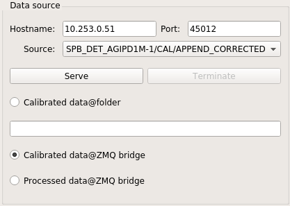

Data Analysis with karaboFAI
============================

Choose the correct version
--------------------------

**karaboFAI** can be started on both online and `Maxwell` clusters. Since we often
receive feature requests within a few days before user experiments, in order to avoid
conflict between different instruments, there are three versions of **karaboFAI**
deployed. Please always consult your contact person if you are not sure which version
to use.

I. Stable version
+++++++++++++++++

This is the latest version which has been successfully used in at least one
commissioning shift or user experiment.

To start the **stable** version on online or `Maxwell` clusters:

.. code-block:: bash

    module load exfel exfel_anaconda3
    karaboFAI DETECTOR_NAME

Valid detectors are `AGIPD`, `LPD`, `JungFrau` and `FastCCD`.

.. note::
    It usually takes some time to start **karaboFAI** for the first time! This
    is actually an issue related to the infrastructure and not because
    **karaboFAI** is slow.

.. note::
    In order to have a better experience with **karaboFAI** on the `Maxwell` cluster,
    you should need FastX2_ at max-display_. There is also a link for downloading
    the desktop client on the bottom-right corner when you opened max-display_. For
    more details, please refer to the official website for FastX2_ at DESY.

.. _FastX2: https://confluence.desy.de/display/IS/FastX2
.. _max-display: https://max-display.desy.de:3443/

II. Pre-release version
+++++++++++++++++++++++

This is the release candidate which has passed our unittest and integration test, but is
still being tested by beamline scientists. This version usually contains (much) more
features than the **stable** version. Normally, the **pre-release** version should be as
stable as the **stable** version.

.. code-block:: bash

    module load exfel exfel_anaconda3/beta
    karaboFAI DETECTOR_NAME

III. Temporary version
++++++++++++++++++++++

If there is any **critical** feature requested in a short notice but DA do not have
enough time to follow the standard development procedure (code review, unittest, etc.),
we will deploy this **temporary** solution. As a result, the stability and correctness
of this version cannot be guaranteed.

.. code-block:: bash

    module load exfel karaboFAI
    karaboFAI DETECTOR_NAME

Data analysis in real time
--------------------------

For real-time data analysis, the (calibrated) data is streamed via a
`ZMQ bridge`, which is a `Karabo` device (`PipeToZeroMQ`) running inside the control network.
Normally, the user should not modify ``Hostname``, ``Port`` and ``Source`` in
the ``Data source`` panel.

.. list-table:: Suggested online clusters
   :header-rows: 1

   * - Instrument
     - Alias
     - DNS primary name

   * - SPB
     - sa1-br-onc-comp-spb
     - exflonc05
   * - FXE
     - sa1-br-onc-comp-fxe
     - exflonc12
   * - SCS
     - sa1-br-kc-comp-1
     - exflonc13
   * - SQS
     - sa1-br-kc-comp-3
     - exflonc15

Data analysis with files
------------------------

**karaboFAI** can be used to replay the experiment with files.

The data is streamed from files after the ``Serve`` button is clicked. The user
is free to use any available ``port``. ``Hostname`` should be `localhost` and
the user needs to specify the full path of the directory which contains the
(calibrated) files.

.. image:: images/data_source_from_file.png
   :width: 300

.. list-table:: Example files
   :header-rows: 1

   * - Detector
     - File directory

   * - AGIPD
     - /gpfs/exfel/exp/XMPL/201750/p700000/proc/r0006
   * - LPD
     - /gpfs/exfel/exp/FXE/201701/p002026/proc/r0078
   * - JungFrau
     - /gpfs/exfel/exp/FXE/201801/p002118/proc/r0143
   * - FastCCD
     - /gpfs/exfel/exp/SCS/201802/p002170/proc/r0141
