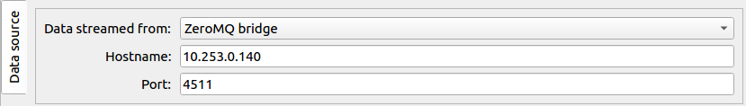

GETTING STARTED
===============

Choose the correct version
--------------------------

**EXtra-foam** can be started on both online and `Maxwell` clusters. Currently, there
are two versions of **EXtra-foam** deployed. Please always consult your contact person
if you are not sure which version to use.

I. Latest version
+++++++++++++++++++++++

This is the latest release of **EXtra-foam**. This version usually contains more
features than the **stable** version.

.. code-block:: bash

    module load exfel EXtra-foam/beta
    extra-foam DETECTOR TOPIC

More info on command line arguments can be obtained as

.. code-block:: console

   [user@exflonc12 ~]$ extra-foam --help

    usage: extra-foam [-h] [-V] [--debug] [--redis_address REDIS_ADDRESS]
                      {AGIPD,LPD,DSSC,JUNGFRAUPR,JUNGFRAU,FASTCCD,BASLERCAMERA}
                      {SPB,FXE,SCS,SQS,MID,HED}

    positional arguments:
      {AGIPD,LPD,DSSC,JUNGFRAUPR,JUNGFRAU,FASTCCD,BASLERCAMERA}
                            detector name (case insensitive)
      {SPB,FXE,SCS,SQS,MID,HED}
                            Name of the instrument

    optional arguments:
      -h, --help            show this help message and exit
      -V, --version         show program's version number and exit
      --debug               Run in debug mode
      --pipeline_slow_policy {0,1}
                            Pipeline policy when the processing rate is slower
                            than the arrival rate (0 for always process the latest
                            data and 1 for wait until processing of the current
                            data finishes)
      --redis_address REDIS_ADDRESS
                            Address of the Redis server

.. note::
    It sometime takes a few minutes to start **EXtra-foam** for the first time! This
    is actually an issue related to the infrastructure and not because
    **EXtra-foam** is slow.

.. note::
    If you are connecting to the online or `Maxwell` clusters via SSH, you will need
    to enable X11 forwarding by including the -X option.

.. note::
    In order to have a better experience with **EXtra-foam** on the `Maxwell` cluster,
    you should need FastX2_ at max-display_. There is also a link for downloading
    the desktop client on the bottom-right corner when you opened max-display_. For
    more details, please refer to the official website for FastX2_ at DESY. Nevertheless,
    it is not recommended to run **EXtra-foam** on the `Maxwell` cluster since streaming
    data from files there is extremely slow.

.. _FastX2: https://confluence.desy.de/display/IS/FastX2
.. _max-display: https://max-display.desy.de:3443/

II. Stable version
++++++++++++++++++

To start the **stable** version on online or `Maxwell` clusters:

.. code-block:: bash

    module load exfel EXtra-foam
    extra-foam DETECTOR TOPIC

Data analysis in real time
--------------------------

For real-time data analysis, the (calibrated) data is streamed via a `ZMQ bridge`, which is
a `Karabo` device (`PipeToZeroMQ`) running inside the control network.

.. _online-clusters: https://in.xfel.eu/readthedocs/docs/data-analysis-user-documentation/en/latest/computing.html#online-cluster

.. note::
    Please check the online-clusters_ available for users at different instruments.

Data analysis with files
------------------------

See :ref:`stream data from run directory`

Trouble Shooting
-----------------

Steps to follow in case you are facing issues operating **EXtra-foam**

- **Could not connect to display**

  While trying to run **EXtra-foam** remotely on the online cluster (exflonc12, etc), if you
  end up with error messages similar to,

  .. code-block:: console

     qt.qpa.xcb: could not connect to display
     qt.qpa.plugin: Could not load the Qt platform plugin "xcb" in "" even though it was found.
     This application failed to start because no Qt platform plugin could be initialized.
     Reinstalling the application may fix this problem.

  please make sure that you have done X11 forwarding while logging to the online cluster.
  Using **EXtra-foam** on Maxwell cluster, it is better to use FastX2_ at max-display_ as
  explained in previous section.

- **Shut down the redis server?**

  If you are prompted to warnings like,

  .. code-block:: console

     [user@exflonc12 ~]$ extra-foam DSSC SCS

     services.py - WARNING - Found Redis server for DSSC (started at 2020-02-06 12:50:03.906872)
     already running on this machine using port 6380!

     You can choose to shut down the Redis server. Please note that the owner of the Redis server
     will be informed (your username and IP address).

     Shut down the existing Redis server? (y/n)

  **EXtra-foam** uses `Redis` as broker to pass meta information between different processes. By
  design, each type of detector has its unique `Redis` port so one can safely run more than one
  **EXtra-foam** instances for different detectors on the same machine. However, it is not allowed
  to run two instances with the same type of detector. Also, **EXtra-foam** receives data from
  **karabo bridge** and thus there can be data loss if there is any instance secretly running
  in the background, stealing the data.

  In the instrument control room, there should be only one **EXtra-foam** instance for the detector
  that is running. Therefore, it is safe to type "y" to shut down the existing *Redis* server.
  However, if somebody wants to make a joke about you and did that remotely, you will get informed.

- **Config file is invalid**

  If you are prompted to warning like,

  .. code-block:: console

     Traceback (most recent call last):
       File "/home/username/anaconda3/envs/foam/bin/extra-foam", line 11, in <module>
         load_entry_point('EXtra-foam', 'console_scripts', 'extra-foam')()
       File "/home/username/xfel-data-analyais/EXtra-foam/extra_foam/services.py", line 356, in application
         config.load(detector, topic)
       File "/home/username/xfel-data-analyais/EXtra-foam/extra_foam/config.py", line 456, in load
         self._data.load(detector, topic)
       File "/home/username/xfel-data-analyais/EXtra-foam/extra_foam/config.py", line 382, in load
         self.from_file(det, topic)
       File "/home/username/xfel-data-analyais/EXtra-foam/extra_foam/config.py", line 393, in from_file
         raise OSError(msg)
     OSError: Invalid config file: /home/username/.EXtra-foam/scs.config.yaml
     ParserError('while parsing a block mapping', <yaml.error.Mark object at 0x7fcffbd84910>,
     "expected <block end>, but found '<block mapping start>'", <yaml.error.Mark object at 0x7fcffbd84ed0>)

  This error is triggered when the :ref:`config file` is not valid. Please correct it if you have modified
  the default one. Alternatively, you can delete it and let the program generate a default one for you.

- **No data is received**

  If **EXtra-foam** opens up fine and running it by clicking on *start* button does
  nothing, please make sure that relevant **PipeToZeroMQ** device is properly
  configured, activated and its *data sent* property is updating. This device
  can be configured only with the help of experts (data analysis support and beamline scientists).

 .. note::

    The entire data analysis workflow with relevant hostnames and ports are provided in the instrument support
    `documentation <https://in.xfel.eu/readthedocs/docs/fxe-instrument-control-infrastructure/en/latest/fxe_dataanalysis_toolbox.html>`__

