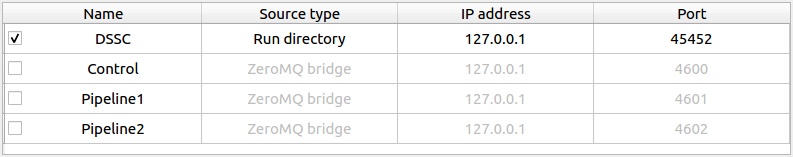

GETTING STARTED
===============

Choose the correct version
--------------------------

**karaboFAI** can be started on both online and `Maxwell` clusters. Currently, there
are two versions of **karaboFAI** deployed. Please always consult your contact person
if you are not sure which version to use.

I. Stable version
+++++++++++++++++

This is the latest version which has been successfully used in at least one
commissioning shift or user experiment.

To start the **stable** version on online or `Maxwell` clusters:

.. code-block:: bash

    module load exfel exfel_anaconda3
    karaboFAI DETECTOR_NAME

.. note::
    The installation is temporary removed since there is conflict in config files between
    the latest deployed 0.5.0 and previous version. Please check the **Pre-release version**
    instead.

.. note::
    It usually takes a few minutes to start **karaboFAI** for the first time! This
    is actually an issue related to the infrastructure and not because
    **karaboFAI** is slow.

.. note::
    If you are connecting to the online or `Maxwell` clusters via SSH, you will need
    to enable X11 forwarding by including the -X option.

.. note::
    In order to have a better experience with **karaboFAI** on the `Maxwell` cluster,
    you should need FastX2_ at max-display_. There is also a link for downloading
    the desktop client on the bottom-right corner when you opened max-display_. For
    more details, please refer to the official website for FastX2_ at DESY.

.. _FastX2: https://confluence.desy.de/display/IS/FastX2
.. _max-display: https://max-display.desy.de:3443/

II. Pre-release version
+++++++++++++++++++++++

This is the release candidate which has passed our unittest and integration test, but is
still being tested by beamline scientists. This version usually contains (much) more
features than the **stable** version. Normally, the **pre-release** version should be as
stable as the **stable** version.

.. code-block:: bash

    module load exfel exfel_anaconda3/beta
    karaboFAI DETECTOR_NAME

Data analysis in real time
--------------------------

For real-time data analysis, the (calibrated) data is streamed via a `ZMQ bridge`, which is
a `Karabo` device (`PipeToZeroMQ`) running inside the control network. Normally, the user
should not need to modify ``Hostname``, ``Port`` and ``Detector source name`` in the
``Data source`` panel.

.. image:: images/data_source_from_bridge.png
   :width: 500

.. list-table:: Suggested online clusters
   :header-rows: 1

   * - Instrument
     - Alias
     - DNS primary name

   * - SPB
     - sa1-br-onc-comp-spb
     - exflonc05
   * - FXE
     - sa1-br-onc-comp-fxe
     - exflonc12
   * - SCS
     - sa1-br-kc-comp-1
     - exflonc13
   * - SQS
     - sa1-br-kc-comp-3
     - exflonc15
   * - MID
     - ...
     - ...
   * - HED
     - ...
     - ...

Data analysis with files
------------------------

**karaboFAI** can be used to replay experiments with files. Click on the
*Offline* window on the tool bar that opens the following window.

.. image:: images/file_stream_control.png

The run folder is browsed through the ``Load Run Folder`` button. The corrected image
data will be streamed from the run folder. If the run folder has path structure
as on `Maxwell GPFS` (/gpfs/exfel/exp/instrument/cycle/proposal/proc/runnumber) then once
the run folder is loaded, all the  slow/control sources available in the
corresponding *raw* folder (or same data folder if no corresponding raw
folder is found) are listed. Users can then choose slow data sources to stream
along with the fast image data.

The data is streamed from files after the ``Stream files`` button is clicked. The user
is free to use any available ``port``. ``Hostname`` should be `localhost`.

.. list-table:: Example files
   :header-rows: 1

   * - Detector
     - File directory

   * - AGIPD
     - /gpfs/exfel/exp/XMPL/201750/p700000/proc/r0006
   * - LPD
     - /gpfs/exfel/exp/FXE/201701/p002026/proc/r0078
   * - JungFrau
     - /gpfs/exfel/exp/FXE/201930/p900063/proc/r1051
   * - FastCCD
     - /gpfs/exfel/exp/SCS/201802/p002170/proc/r0141
   * - DSSC
     - /gpfs/exfel/exp/SCS/
