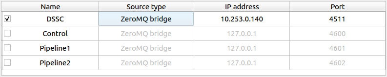

GETTING STARTED
===============

Choose the correct version
--------------------------

**EXtra-foam** can be started on both online and `Maxwell` clusters. Currently, there
are two versions of **EXtra-foam** deployed. Please always consult your contact person
if you are not sure which version to use.

I. Latest version
+++++++++++++++++++++++

This is the latest release of **EXtra-foam**. This version usually contains more
features than the **stable** version.

.. code-block:: bash

    module load exfel exfel_anaconda3/beta
    extra-foam DETECTOR_NAME --topic TOPIC_NAME

.. note::

   *TOPIC_NAME* command line option is available for karaboFAI version >= 0.5.3

More info on command line arguments can be obtained as

.. code-block:: console

   [user@exflonc12 ~]$ extra-foam --help

   usage: extra-foam [-h] [-V] [--debug] [--topic {FXE,HED,MID,SCS,SPB,SQS}]
                  {AGIPD,LPD,JUNGFRAU,FASTCCD,BASLERCAMERA,DSSC}

   positional arguments:
      {AGIPD,LPD,JUNGFRAU,FASTCCD,BASLERCAMERA,DSSC}
                          detector name (case insensitive)

   optional arguments:
     -h, --help            show this help message and exit
     -V, --version         show program's version number and exit
     --debug               Run in debug mode
     --topic {FXE,HED,MID,SCS,SPB,SQS}
                           Name of the instrument

.. note::
    It usually takes a few minutes to start **EXtra-foam** for the first time! This
    is actually an issue related to the infrastructure and not because
    **EXtra-foam** is slow.

.. note::
    If you are connecting to the online or `Maxwell` clusters via SSH, you will need
    to enable X11 forwarding by including the -X option.

.. note::
    In order to have a better experience with **EXtra-foam** on the `Maxwell` cluster,
    you should need FastX2_ at max-display_. There is also a link for downloading
    the desktop client on the bottom-right corner when you opened max-display_. For
    more details, please refer to the official website for FastX2_ at DESY.

.. _FastX2: https://confluence.desy.de/display/IS/FastX2
.. _max-display: https://max-display.desy.de:3443/

II. Stable version
++++++++++++++++++

To start the **stable** version on online or `Maxwell` clusters:

.. code-block:: bash

    module load exfel extra_foam
    extra-foam DETECTOR_NAME --topic TOPIC_NAME

Data analysis in real time
--------------------------

For real-time data analysis, the (calibrated) data is streamed via a `ZMQ bridge`, which is
a `Karabo` device (`PipeToZeroMQ`) running inside the control network.

.. _online-clusters: https://in.xfel.eu/readthedocs/docs/data-analysis-user-documentation/en/latest/computing.html#online-cluster

.. note::
    Please check the online-clusters_ available for users at different instruments.

Data analysis with files
------------------------

**EXtra-foam** can be used to replay experiments with files. Click on the
*Offline* window on the tool bar that opens the following window.

.. image:: images/file_stream_control.png

The run folder is browsed through the ``Load Run Folder`` button. The corrected image
data will be streamed from the run folder. If the run folder has path structure
as on `Maxwell GPFS` (/gpfs/exfel/exp/instrument/cycle/proposal/proc/runnumber) then once
the run folder is loaded, all the  slow/control sources available in the
corresponding *raw* folder (or same data folder if no corresponding raw
folder is found) are listed. Users can then choose slow data sources to stream
along with the fast image data.

The data is streamed from files after the ``Stream files`` button is clicked. The user
is free to use any available ``port``. ``Hostname`` should be `localhost`.

.. image:: images/data_source_from_file.png
   :width: 500

.. list-table:: Example files
   :header-rows: 1

   * - Detector
     - File directory

   * - AGIPD
     - /gpfs/exfel/exp/XMPL/201750/p700000/proc/r0006
   * - LPD
     - /gpfs/exfel/exp/FXE/201701/p002026/proc/r0078
   * - JungFrau
     - /gpfs/exfel/exp/FXE/201930/p900063/proc/r1051
   * - FastCCD
     - /gpfs/exfel/exp/SCS/201802/p002170/proc/r0141
   * - DSSC
     - /gpfs/exfel/exp/SCS/

Trouble Shooting
-----------------

Steps to follow in case you are facing issues operating **EXtra-foam**

- While trying to run **EXtra-foam** remotely on the online cluster (exflonc12, etc), if you
  end up with error messages similar to,

  .. code-block:: console

     qt.qpa.xcb: could not connect to display
     qt.qpa.plugin: Could not load the Qt platform plugin "xcb" in "" even though it was found.
     This application failed to start because no Qt platform plugin could be initialized.
     Reinstalling the application may fix this problem.

  please make sure that you have done X11 forwarding while logging to the online cluster.
  Using **EXtra-foam** on Maxwell cluster, it is better to use FastX2_ at max-display_ as
  explained in previous section.

- If you are prompted to warnings like,

  .. code-block:: console

     [user@exflonc12 ~]$ extra-foam JUNGFRAU

     Warning: Found old extra-foam instance(s) running in this machine!!!
     Running more than two extra-foam instances with the same
     detector can result in undefined behavior. You can try to
     kill the other instances if it is owned by you.
     Note: you are not able to kill other users' instances!
     Send SIGKILL? (y/n)

  It is safe and encourage to select *y* since you cannot kill other users instance and
  it helps you to kill zombie processes of **EXtra-foam**. However, there is a known bug
  that if you have another instance with a different detector running, selecting *y* will kill
  that instance which indeed has no conflict with the new instance. But be aware that,
  if the other **EXtra-foam** instance is also running with the same detector argument
  then this may cause an undefined behavior in the analysis since change of analysis
  parameters by one user will be reflected in your instance too.

  **EXtra-foam** receive data from the **karabo bridge** (*PipeToZeroMQ*) device
  and therefore running multiple instances may lead to data loss.

 .. note::

   It is therefore recommended not to run multiple instances of
   **EXtra-foam** for the same detector argument on the same online cluster

- If you are prompted to warning like,

  .. code-block:: console

     The following invalid keys were found in /home/user/.karaboFAI/config.json:

     LPD.GEOMETRY_FIL1.

     This could be caused by a version update.
     Create a new config file? (y/n)

  This warning is triggered when the local config file `/home/user/.karaboFAI/config.json` 
  was either created by an old version of **EXtra-foam** or some keys name were manually
  changed by the user by mistake like in the above warning "GEOMETRY_FILE" key that 
  is expected by **EXtra-foam** was manually changed to "GEOMETRY_FIL1" by the user in their
  local config file.

 .. note::

    It is recommended to say **y** (YES) and proceed and a new local config file will
    be generated by **EXtra-foam** which user can edit later for convenience.

- If **EXtra-foam** opens up fine and running it by clicking on *start* button does
  nothing, please make sure that relevant **PipeToZeroMQ** device is properly
  configured, activated and its *data sent* property is updating. This device
  can be configured only with the help of experts (CAS support and beamline scientists).

- While performing correlation or binning analysis in **EXtra-foam**, if you are
  prompted to error messages like,

  .. code-block:: console

     ERROR - ProcessingError("[Correlation] Device 'FXE_SMS_USR/MOTOR/UM02' is not in the data!",)

  This can happen due to several reasons for.eg. Relevant **Data Correlator** (*DataCorrelator*)
  device is not running, or the slow source was not added to the **Data Correlator**
  device or **EXtra-foam** is not listening to the correct port where the **karabo bridge**
  is sending the correlated data. 

 .. note::

    The entire data analysis workflow with relevant hostnames and ports are provided in the instrument support
    `documentation <https://in.xfel.eu/readthedocs/docs/fxe-instrument-control-infrastructure/en/latest/fxe_dataanalysis_toolbox.html>`__

