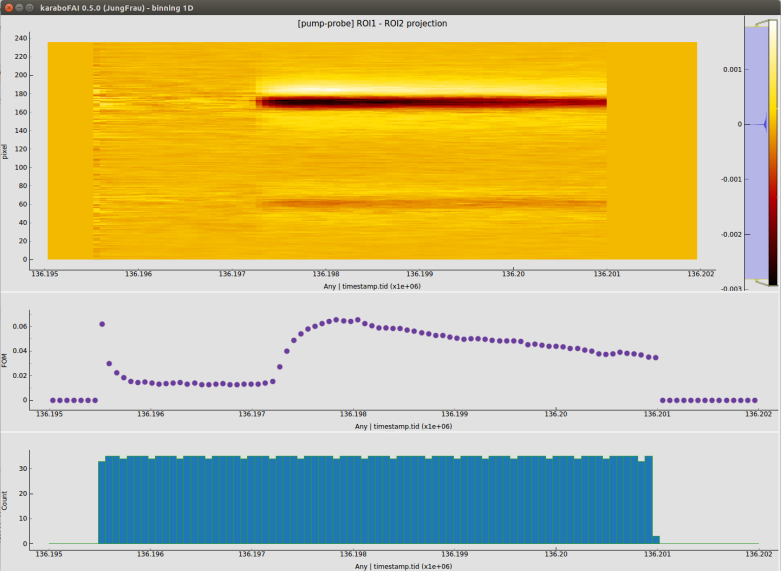

.. _statistics analysis:

STATISTICS ANALYSIS
===================

Binning
-------

Setup the visualization of 1D/2D binning of the FOM and VFOM for a certain analysis type.

+----------------------------+--------------------------------------------------------------------+
| Input                      | Description                                                        |
+============================+====================================================================+
| *Analysis type*            | See :ref:`Analysis type`.                                          |
+----------------------------+--------------------------------------------------------------------+
| *Mode*                     | The data in each bin will be                                       |
|                            |                                                                    |
|                            | - *average*: averaged;                                             |
|                            |                                                                    |
|                            | - *accumulate*: summed up.                                         |
+----------------------------+--------------------------------------------------------------------+
| *Category*                 | Category of the slow data.                                         |
+----------------------------+--------------------------------------------------------------------+
| *Karabo device ID*         | ID of the Karabo device which produces the slow data.              |
+----------------------------+--------------------------------------------------------------------+
| *Property name*            | Property name in the Karabo device.                                |
+----------------------------+--------------------------------------------------------------------+
| *Value range*              | (Min, max) value of the bins.                                      |
+----------------------------+--------------------------------------------------------------------+
| *# of bins*                | Number of bins.                                                    |
+----------------------------+--------------------------------------------------------------------+
| *Reset*                    | Reset the binning history.                                         |
+----------------------------+--------------------------------------------------------------------+

Histogram
---------

Setup the visualization of pulse- / train- resolved statistics analysis.

+----------------------------+--------------------------------------------------------------------+
| Input                      | Description                                                        |
+============================+====================================================================+
| *Analysis type*            | See :ref:`Analysis type`.                                          |
+----------------------------+--------------------------------------------------------------------+
| *# of bins*                | Number of bins of the histogram.                                   |
+----------------------------+--------------------------------------------------------------------+
| *Reset*                    | Reset the histogram history.                                       |
+----------------------------+--------------------------------------------------------------------+

Correlation
"""""""""""

Setup the visualization of correlations of a given FOM with various slow data.

+----------------------------+--------------------------------------------------------------------+
| Input                      | Description                                                        |
+============================+====================================================================+
| *Analysis type*            | See :ref:`Analysis type`.                                          |
+----------------------------+--------------------------------------------------------------------+
| *Category*                 | Category of the slow data.                                         |
+----------------------------+--------------------------------------------------------------------+
| *Karabo device ID*         | ID of the Karabo device which produces the slow data.              |
+----------------------------+--------------------------------------------------------------------+
| *Property name*            | Property name in the Karabo device.                                |
+----------------------------+--------------------------------------------------------------------+
| *Resolution*               | 0 for scattering plot and any positive value for bar plot          |
+----------------------------+--------------------------------------------------------------------+
| *Reset*                    | Reset the correlation history.                                     |
+----------------------------+--------------------------------------------------------------------+
