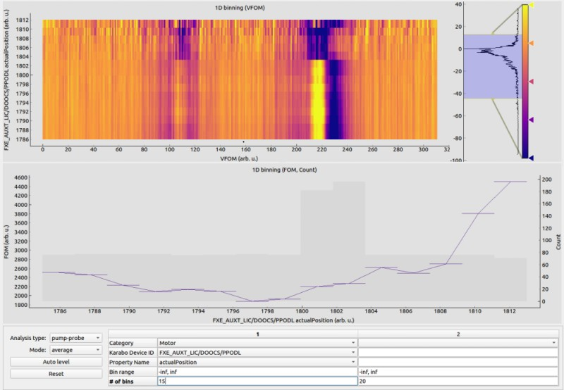
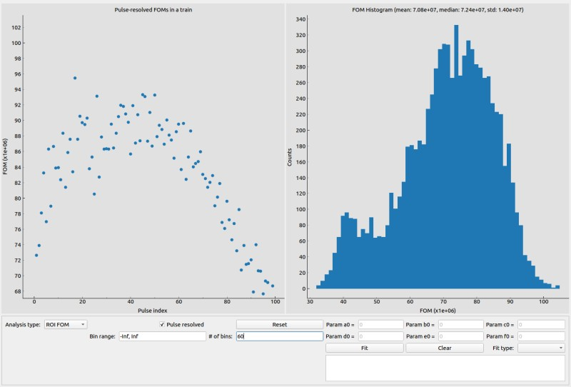
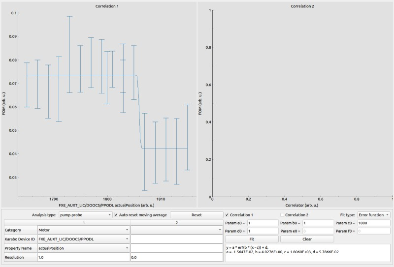

.. _statistics analysis:

STATISTICS ANALYSIS
===================

.. _Binning:

Binning
-------

The binning window allows to setup the visualization of 1D/2D binning of the
FOM and VFOM for different analysis types. For now, it works only with train-resolved data. For instance,
you can bin the sum of a ROI of the averaged frames in a train with respect to a motor position, while
binning the sum of a ROI of each frame in a train with respect to a motor position or the XGM intensity
in each corresponding pulse is not supported yet. As a result, internally it maintains a buffer with a length
of **18,000**, which corresponds to the number of data points collected in 30 minutes. The old data point
will be discarded when the buffer is full.

The first binning parameter is used for both 1D and 2D binning, while the second binning parameter is only
used for 2D binning. When any of the ``Mode``, ``Bin range`` and ``# of bins`` changes, the internally cached
data will be re-binned. However, the program is smart enough to clear the cached data under certain conditions:

- ``Analysis type`` changed;
- The sub analysis type of the pump-probe analysis changed if the current analysis type if *pump-probe*;
- ``Karabo Device ID`` and/or ``Property name`` changed. It is worthy of mentioning that, if the second
  binning parameter was removed, the on-going 1D binning will not be affected, i.e. the cached data will
  not be cleared. However, if the second binning parameter was added, the on-going 1D binning will start from
  scratch. The rational behind the design is that the internally cached 1D and 2D binning data must be aligned;
- The length of VFOM changed. For instance, the shape of the ROI changed when the analysis type is ``ROI proj``.

, since it does not make sense to mix the new and old data together. In this case, users don't need to remind
themselves to click the reset button.

+----------------------------+--------------------------------------------------------------------+
| Input                      | Description                                                        |
+============================+====================================================================+
| ``Analysis type``          | See :ref:`Analysis type`.                                          |
+----------------------------+--------------------------------------------------------------------+
| ``Mode``                   | The data in each bin will be                                       |
|                            |                                                                    |
|                            | - *average*: averaged;                                             |
|                            |                                                                    |
|                            | - *accumulate*: summed up.                                         |
+----------------------------+--------------------------------------------------------------------+
| ``Reset``                  | Reset the binning history.                                         |
+----------------------------+--------------------------------------------------------------------+
| ``Category``               | Category of the slow data.                                         |
+----------------------------+--------------------------------------------------------------------+
| ``Karabo device ID``       | ID of the Karabo device which produces the slow data.              |
+----------------------------+--------------------------------------------------------------------+
| ``Property name``          | Property name in the Karabo device.                                |
+----------------------------+--------------------------------------------------------------------+
| ``Bin range``              | Lower and upper boundaries of all the bins. In case of *+/- Inf*,  |
|                            | the boundary will be calculated dynamically.                       |
+----------------------------+--------------------------------------------------------------------+
| ``# of bins``              | Number of bins.                                                    |
+----------------------------+--------------------------------------------------------------------+
| ``Auto level``             | Reset the levels of heatmaps in the *Binning* window.              |
+----------------------------+--------------------------------------------------------------------+

.. warning::

    Explicitly setup the binning range whenever possible. Normally binning only takes less than
    1 ms with a predefined bin range. However, the cost could increase to a few tens of ms with
    a dynamic bin range!

.. _Histogram:

Histogram
---------

Setup the visualization of pulse- / train- resolved statistics analysis.

+----------------------------+--------------------------------------------------------------------+
| Input                      | Description                                                        |
+============================+====================================================================+
| ``Analysis type``          | See :ref:`Analysis type`.                                          |
+----------------------------+--------------------------------------------------------------------+
| ``pulse resolved``         | This checkbox is only enabled for the pulse-resolved detectors.    |
|                            | When it is checked, the histogram is pulse-wise. Otherwise, the    |
|                            | histogram is train-wise.                                           |
+----------------------------+--------------------------------------------------------------------+
| ``Bin range``              | Lower and upper boundaries of all the bins. In case of *+/- Inf*,  |
|                            | the boundary will be calculated dynamically.                       |
+----------------------------+--------------------------------------------------------------------+
| ``# of bins``              | Number of bins of the histogram.                                   |
+----------------------------+--------------------------------------------------------------------+
| ``Reset``                  | Reset the histogram history.                                       |
+----------------------------+--------------------------------------------------------------------+

.. _Correlation:

Correlation
-----------

The correlation window allows to setup the visualization of correlations of a given FOM with
various control data. Two plot types are supported in the correlation analysis:

- Scatter plot

  Scatter plot is the most commonly used plot type and it can be activated in the correlation
  window by setting ``Resolution`` to 0 (default).

- Statistics bar plot

  Statistics bar plot is very useful in the so-called "stop-and-scan" analysis: *a motor moves
  along a predefined path and it stays at each location for a certain period of time to collect
  enough data*. It is activated when ``Resolution`` is larger than 0. The y values of the upper
  and lower bars in the plot are :math:`\bar{y} + {\sigma}` and :math:`\bar{y} - {\sigma}`, respectively,
  where :math:`\bar{y}` the mean and :math:`{\sigma}` the standard deviation of the FOM values
  at that point. The widths of both bars are equal to ``Resolution``.
  Specifically, assuming the current statistics point recorded an average x value of :math:`\bar{x}`
  and a new data (x, y) arrives, a new statistics point will be started if :math:`|\bar{x} - x| > r`,
  where `r` is ``Resolution``.
  Otherwise, the statistics of the current point will be updated.
  It should be noted that *if there is only 1 data at a statistics point, the point will be discarded.*

  The statistics bar plot is very similar to 1D binning. However, different from 1D binning,
  a new statistics point will be recorded if the motor moves away and later comes back to the same location.

.. note::

    One can change the value of resolution on-the-fly without resetting the whole data history.

+-------------------------------+--------------------------------------------------------------------+
| Input                         | Description                                                        |
+===============================+====================================================================+
| ``Analysis type``             | See :ref:`Analysis type`.                                          |
+-------------------------------+--------------------------------------------------------------------+
| ``Category``                  | Category of the slow data.                                         |
+-------------------------------+--------------------------------------------------------------------+
| ``Karabo device ID``          | ID of the Karabo device which produces the slow data.              |
+-------------------------------+--------------------------------------------------------------------+
| ``Property name``             | Property name in the Karabo device.                                |
+-------------------------------+--------------------------------------------------------------------+
| ``Resolution``                | 0 for scatter plot and any positive value for statistics bar plot. |
+-------------------------------+--------------------------------------------------------------------+
| ``Reset``                     | Reset the correlation history.                                     |
+-------------------------------+--------------------------------------------------------------------+
| ``Auto reset moving average`` | Check to automatically reset moving average in the                 |
|                               | "stop-and-scan" analysis when a new point starts. *Only apply to   |
|                               | correlation 1.*                                                    |
+-------------------------------+--------------------------------------------------------------------+

One can also plot FOMs of ROI1 and ROI2 together when the *master-slave* mode is activated in
:ref:`ROI FOM setup`.
