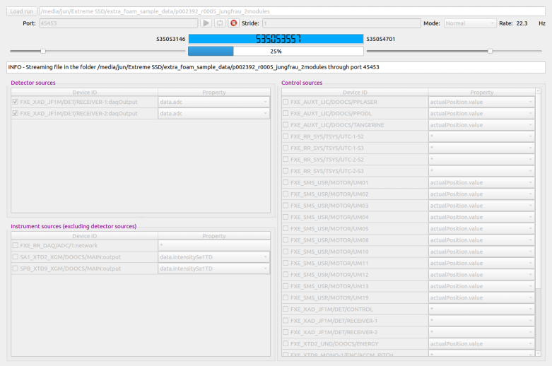

.. _stream data from run directory:

STREAM DATA FROM RUN DIRECTORY
==============================

.. image:: images/data_source_from_file.png
   :width: 500

File stream
"""""""""""

**EXtra-foam** can be used to replay experiments with stored files. To start,
click on the *File stream* icon on the tool bar to opens the following window:

*Alternatively*, one can type

.. code-block:: bash

    extra-foam-stream

in another terminal to open the above window. This is useful for development since one
does not have to set up the streamer again when restarting **EXtra-foam**.

+----------------------------+--------------------------------------------------------------------+
| Input                      | Description                                                        |
+============================+====================================================================+
| ``Load run``               | Click to select a run folder. The run folder can also be specified |
|                            | via entering the full path.                                        |
+----------------------------+--------------------------------------------------------------------+
| ``Port``                   | The TCP port from which the data is streamed. If the GUI is not    |
|                            | opened from the terminal, the ``Port`` is readonly and internally  |
|                            | it is the same as the port specified in the :ref:`Data source`     |
|                            | panel in the main GUI.                                             |
+----------------------------+--------------------------------------------------------------------+
| ``Start``                  | Press to start streaming.                                          |
+----------------------------+--------------------------------------------------------------------+
| ``Terminate``              | Press to terminate streaming. If ``Start`` is pressed again,       |
|                            | the data will be streamed from the beginning                       |
+----------------------------+--------------------------------------------------------------------+
| ``Repeat stream``          | When checked, if the stream reaches the end of the data, the       |
|                            | stream will restart from the beginning with a faked *train ID*,    |
|                            | which ensures that the *train ID* continuously increases in the    |
|                            | new cycle. This feature is only useful for developers.             |
+----------------------------+--------------------------------------------------------------------+

.. note::
    If the specified run folder has a path structure as on `Maxwell GPFS` (*.../proc/runnumber/*).
    The loader will try to load the data (e.g. control data) other than the
    detector data from *.../raw/runnumber/* first and fall back to *.../proc/runnumber/* if
    *.../raw/runnumber/* is not a valid run directory. This is needed for large multi-module
    detectors, as the folder *.../proc/runnumber/* only stores the calibrated detector data.

Sample run directories
""""""""""""""""""""""

.. note::
    Streaming files from the online cluster is pretty fast. However, it is sometimes unbearable to stream
    a large run from the `Maxwell` cluster. For development, it is recommended to copy a few files in a run
    to a local directory.

+------------+---------------------------------------------------+------------------------------------------+
|            | Run directory                                     | Description                              |
+============+===================================================+==========================================+
| AGIPD      | /gpfs/exfel/d/raw/SPB/201931/p900086/r0009        | 250 pulses                               |
+------------+---------------------------------------------------+------------------------------------------+
|            | /gpfs/exfel/exp/SPB/201831/p900039/proc/r0273     | Nice ring, 176 pulses                    |
+------------+---------------------------------------------------+------------------------------------------+
| LPD        | /gpfs/exfel/exp/FXE/201802/p002218/raw/r0229      | ring, 100 pulses                         |
|            +---------------------------------------------------+------------------------------------------+
|            | /gpfs/exfel/exp/FXE/201802/p002218/proc/r0229     | ring, 100 pulses                         |
+------------+---------------------------------------------------+------------------------------------------+
| DSSC       | /gpfs/exfel/exp/SCS/201901/p002212/raw/r0061      | pump-probe, 70 pulses                    |
|            +---------------------------------------------------+------------------------------------------+
|            | /gpfs/exfel/exp/SCS/201901/p002212/raw/r0059      | pump-probe (dark), 70 pulses             |
+------------+---------------------------------------------------+------------------------------------------+
| JungFrau   | /gpfs/exfel/exp/FXE/201930/p900063/proc/r1051     | pump-probe                               |
|            +---------------------------------------------------+------------------------------------------+
|            | /gpfs/exfel/exp/FXE/201930/p900063/raw/r1051      | pump-probe                               |
+------------+---------------------------------------------------+------------------------------------------+
| FastCCD    | /gpfs/exfel/exp/SCS/201802/p002170/proc/r0141     |                                          |
|            +---------------------------------------------------+------------------------------------------+
|            | /gpfs/exfel/exp/SCS/201802/p002170/raw/r0141      |                                          |
+------------+---------------------------------------------------+------------------------------------------+
| Gotthard   | /gpfs/exfel/exp/MID/201931/p900090/raw/r0395      | Test data                                |
|            +---------------------------------------------------+------------------------------------------+
|            | /gpfs/exfel/exp/MID/201931/p900090/raw/r0300      | Test data (dark)                         |
+------------+---------------------------------------------------+------------------------------------------+
