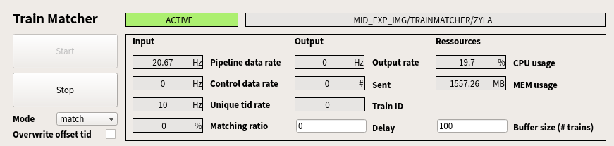

Troubleshooting
===============

.. _FastX2: https://confluence.desy.de/display/IS/FastX2
.. _max-display: https://max-display.desy.de:3443/

Starting-up issues
------------------

Could not connect to display
++++++++++++++++++++++++++++

While trying to run **EXtra-foam** remotely on the online cluster (exflonc12, etc), if you
end up with error messages similar to,

.. code-block:: console

   qt.qpa.xcb: could not connect to display
   qt.qpa.plugin: Could not load the Qt platform plugin "xcb" in "" even though it was found.
   This application failed to start because no Qt platform plugin could be initialized.
   Reinstalling the application may fix this problem.

please make sure that you have done X11 forwarding while logging to the online cluster.
Using **EXtra-foam** on Maxwell cluster, it is better to use FastX2_ at max-display_ as
explained in previous section.

- **Shut down the redis server?**

If you are prompted to warnings like,

.. code-block:: console

   [user@exflonc12 ~]$ extra-foam DSSC SCS

   services.py - WARNING - Found Redis server for DSSC (started at 2020-02-06 12:50:03.906872)
   already running on this machine using port 6380!

   You can choose to shut down the Redis server. Please note that the owner of the Redis server
   will be informed (your username and IP address).

   Shut down the existing Redis server? (y/n)

**EXtra-foam** uses `Redis` as broker to pass meta information between different processes. By
design, each type of detector has its unique `Redis` port so one can safely run more than one
**EXtra-foam** instances for different detectors on the same machine. However, it is not allowed
to run two instances with the same type of detector. Also, **EXtra-foam** receives data from
**karabo bridge** and thus there can be data loss if there is any instance secretly running
in the background, stealing the data.

In the instrument control room, there should be only one **EXtra-foam** instance for the detector
that is running. Therefore, it is safe to type "y" to shut down the existing *Redis* server.
However, if somebody wants to make a joke about you and did that remotely, you will get informed.

Config file is invalid
++++++++++++++++++++++

If you are prompted to warning like,

.. code-block:: console

   Traceback (most recent call last):
     File "/home/username/anaconda3/envs/foam/bin/extra-foam", line 11, in <module>
       load_entry_point('EXtra-foam', 'console_scripts', 'extra-foam')()
     File "/home/username/xfel-data-analyais/EXtra-foam/extra_foam/services.py", line 356, in application
       config.load(detector, topic)
     File "/home/username/xfel-data-analyais/EXtra-foam/extra_foam/config.py", line 456, in load
       self._data.load(detector, topic)
     File "/home/username/xfel-data-analyais/EXtra-foam/extra_foam/config.py", line 382, in load
       self.from_file(det, topic)
     File "/home/username/xfel-data-analyais/EXtra-foam/extra_foam/config.py", line 393, in from_file
       raise OSError(msg)
   OSError: Invalid config file: /home/username/.EXtra-foam/scs.config.yaml
   ParserError('while parsing a block mapping', <yaml.error.Mark object at 0x7fcffbd84910>,
   "expected <block end>, but found '<block mapping start>'", <yaml.error.Mark object at 0x7fcffbd84ed0>)

This error is triggered when the :ref:`config file` is not valid. Please correct it if you have modified
the default one. Alternatively, you can delete it and let the program generate a default one for you.

Incorrect dependencies
++++++++++++++++++++++

If you happen to have some Python packages which are used in **EXtra-foam** but
in the meanwhile installed in your `~/.local` directory, anything bad can happen if
they have different version numbers. In the best case, **EXtra-foam** crashes, for example,
when it attempted to call a function which does not exist in your local installation, and you
will immediately notice it. In the worst case, the software keeps running but the result
is incorrect and the difference between the incorrect result and the correct one is
unperceivable.

This is the downside of using Anaconda to deploy software. However, it is easy to
track down the loathful Python package if you already have one or a few suspects. Assuming
the module `EXtra-foam/beta` is loaded, you can check the suspect one-by-one by following
the example below:

.. code-block:: console

  ~ python
  Python 3.7.3 (default, Mar 27 2019, 22:11:17)
  [GCC 7.3.0] :: Anaconda, Inc. on linux
  Type "help", "copyright", "credits" or "license" for more information.
  >>> import redis
  >>> print(redis.__file__)
  # expected result :-)
  /gpfs/exfel/sw/software/xfel_anaconda3/EXtra-foam-beta/lib/python3.7/site-packages/redis/__init__.py
  # This is bad!
  /home/username/.local/lib/python3.7/site-packages/redis/__init__.py

The remedy is simply. Run `pip uninstall` to remove your local installation.

.. _Operational issues:

Operational issues
------------------

No data is received
+++++++++++++++++++

If **EXtra-foam** opens up fine and running it by clicking on the *Start* button
in the :ref:`Main_GUI` does nothing, please make sure that relevant
:ref:`TrainMatcher <trainmatcher>` device is properly configured, activated, and
sending data.

.. _fig_trainmatcher_status:

   Example of the matching/streaming status panel of a TrainMatcher.

There is a wonderous number of things that could go wrong:

- Matching might be failing. This can be checked by looking at the matching
  ratio, in the above screenshot the matching ratio is 0%.

  This could be for a couple of reasons:

  - A source is not found. If the TrainMatcher cannot get data from a device for
    some reason, it will display a status message in the sources list.

    .. figure:: images/trainmatcher_source_errors.png
       :align: center

       Examples of errors the TrainMatcher shows for sources it can't connect
       to.

  - A source is enabled that isn't sending data. Check this by looking at the
    statistics table in the TrainMatcher:

    .. image:: images/trainmatcher_statistics.png

    In this case one of the cameras (``MID_EXP_SAM/CAM/CAM3:output``) isn't
    sending any data (its update rate is 0Hz), so disabling that camera would
    fix the matching. Of course, if the device is actually meant to be streaming
    data that would point to an issue with the device (e.g. maybe the camera
    isn't acquiring).

  - The buffer size is too low. Data from different sources arrives at slightly
    different times, and unmatched trains are kept in a buffer which are
    continually checked and matched as new data comes in. If a source has
    unusually high latency and the buffer size is too small, old trains may be
    removed from the buffer before the data from the high-latency source has a
    chance to arrive.

    You can check this by looking at the latency column in the statistics table,
    and comparing it to the buffer size in the :ref:`matching/streaming status
    panel <fig_trainmatcher_status>`. In the screenshot above of the statistics
    table, there's only a couple trains of latency so a buffer size of 100
    should be plenty.

    .. note::
       If the latency of sources is ridiculously high (e.g. hundreds of
       millions of trains), the TrainMatcher is probably running on a device
       server that hasn't been configured with a timeserver, so it's reporting
       the wrong latency. The device server will need to be reconfigured with a
       timeserver and restarted. This needs to be done by an expert, so ask your
       local DA contact or email da-support@xfel.eu.

- Sending might be failing. Check this with the ``Output rate`` and ``Sent``
  fields in the :ref:`matching/streaming status panel
  <fig_trainmatcher_status>`. If the output rate is 0Hz (and the matching ratio
  is is not 0Hz), then there's a couple of possibilities:

  - If there are no interfaces listed in the bridge outputs list in
    TrainMatcher, then check the ``ZeroMQ configuration`` property of the
    TrainMatcher.

    - If the property is empty the TrainMatcher doesn't yet have a bridge
      configured, and you should ask your local DA contact for help configuring
      the TrainMatcher (or email da-support@xfel.eu).
    - If it's not empty, then some other process might be using that port and
      blocking the TrainMatcher from binding to it. Check this by SSH'ing into
      the machine running the TrainMatcher (while the TrainMatcher device is
      shutdown) and searching for used ports:

      .. code-block:: bash

         # Search for the port that the TrainMatcher is configured to use
         $ netstat -antlp | grep 45059
         (Not all processes could be identified, non-owned process info
          will not be shown, you would have to be root to see it all.)
         tcp        0      0 10.253.0.171:45059      0.0.0.0:*               LISTEN      24296/python3       
         tcp        0      0 10.253.0.171:45059      10.253.0.151:51012      ESTABLISHED 24296/python3  

      In this example, there's a ``python3`` process with PID ``24296`` bound to
      port ``45059``. If you see a similar process, *do not* attempt to kill it
      yourself, but contact an expert.

      However, in the past we've also observed a strange bug that occurs if a
      TrainMatcher crashes in the middle of operation while EXtra-foam is
      connected to it: EXtra-foam will keep the connection to the port, and even
      though it's not bound to it, that alone will block the TrainMatcher from
      binding to the port. In this case you'll see something like:

      .. code-block:: bash

         $ netstat -antlp | grep 45056
         (Not all processes could be identified, non-owned process info
         will not be shown, you would have to be root to see it all.)
         tcp        0      0 10.253.0.171:45056      10.253.0.171:45056      ESTABLISHED 133974/python

      There's only a single ``ESTABLISHED`` connection to that port, which in
      this case is from EXtra-foam. Restarting EXtra-foam and then the
      TrainMatcher should fix this.

  - Otherwise, EXtra-foam is probably configured to read from the wrong
    hostname/port. Check that the :ref:`bridge settings` match that of the
    TrainMatcher.
- EXtra-foam cannot find the sources it's configured for in the data being
  streamed from the TrainMatcher. In this case, the TrainMatcher will show that
  data is being sent but EXtra-foam will do nothing.

  This could be because:

  - There's a typo in some source name in EXtra-foam, in which case you'll need
    to modify the :ref:`Data source tree`.
  - EXtra-foam has the right source name, but it hasn't been enabled in the
    TrainMatcher. You'll need to cross-check the enabled sources in EXtra-foam
    and the TrainMatcher.
