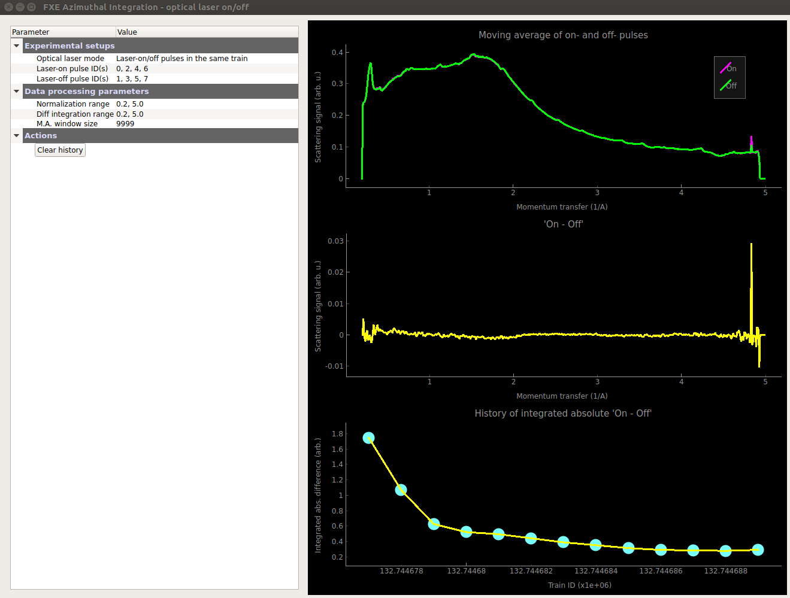

Optical Laser Pattern Window
============================

The `optical laser pattern window` is used in pump-and-probe experiments
with an optical laser. It monitors:

- The moving average of the average of the azimuthal integration
  of all laser-on and laser-off pulses, as well as their difference;
- The evolution of the figure of merit (FOM), which is integration
  of the absolute difference between the moving average of the
  laser-on and laser-off results, for each pair of laser-on and
  laser-off trains.

