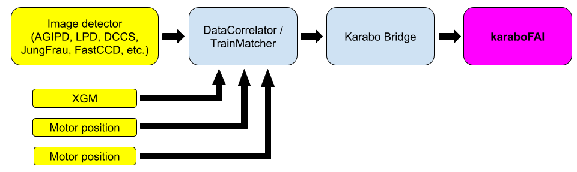

.. _data flow:

DATA FLOW
=========

.. _Karabo: https://doi.org/10.1107/S1600577519006696
.. _karabo-bridge-py: https://github.com/European-XFEL/karabo-bridge-py
.. _ZeroMQ: https://github.com/zeromq

..

At European XFEL, **EXtra-foam** receives data from the distributed control framework Karabo_.

Data received from different sensors/detectors located at different locations need to be
"aligned" for further analysis. At European XFEL, the accelerator produces 10 bunch trains per
second. As a result, data are stamped and can only be aligned by **Train ID**. For big modular
detectors like AGIPD, LPD, DSSC, etc., alignment of data from different modules are carried out
in the so-called "calibration pipeline". However, in most use cases, users will also want to align
the detector data with motor positions and/or some other detectors (e.g. XGM, digitizer).

Fortunately, the aforementioned alignment is taken care of by *DataCorrelator*/*TrainMatcher*
Karabo devices or EXtra-foam, users do not need to worry about that. As shown in the data flow
chart below, there are three scenarios in **EXtra-foam**:

1. After the data from different sources are aligned in *DataCorrelator*/*TrainMatcher*, they
will be serialized and streamed using ZeroMQ_. This process is performed inside the *PipeToZeroMQ*
device, which is also known as "Karabo bridge". **EXtra-foam** makes use of the karabo-bridge-py_,
which is the client of the "Karabo bridge", to receive and deserialize the data.

2. One can also send unaligned data separately into the Karabo bridge and **EXtra-foam** will
align the data automatically after receiving the data. If not all the requested data in a given
train can be found, they will be discarded.

3. One can also send different data items via different Karabo bridges to **EXtra-foam**.

Postponing the data alignment in **EXtra-foam** is encouraged since it leads to lower latency.
For example, suppose you would like to align data item 'A', which includes 32 frames of 1-Megapixel
image data, and data item 'B", which is just a floating-point number. Reasonably, 'B' could always
arrive 100 ms later than 'A' at the the computer in which a *DataCorrelator* and a *PipeToZeroMQ*
devices are both running. If 'A' has to wait for 'B' in the *DataCorrelator*, it will take 200 ms in total
for them to reach **EXtra-foam**, assuming transferring 'A" via ZeroMQ_ takes 100 ms. However, if 'A'
and 'B' can be sent out without being aligned, it will only take 100 ms for both of them to reach
**EXtra-foam** and being immediately processed. It should be noted that the time spent on alignment
the data is negligible.

