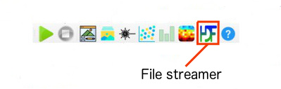
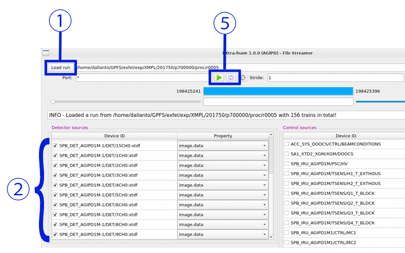
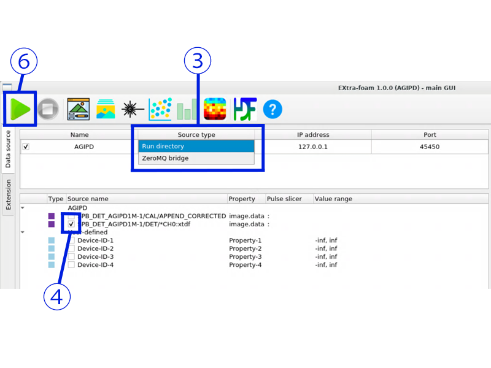

.. _file stream:

STREAMING FROM FILE
===================

There is a stand-alone tool, the EXtra-foam file streamer, dedicated to provide
a data stream from files of a run directory. This tool has its own GUI window.

Overview of user operation steps:
"""""""""""""""""""""""""""""""""

#. Open the file streamer (from the main GUI or command-line)
#. Select and load the run directory
#. Select the sources from the files to be streamed
#. In the main GUI, change the streaming source type (mode)
#. Select the appropriate source name the in the main GUI
#. Start sending the stream in the streaming window
#. Start processing of data in the main GUI

Opening the file streamer
"""""""""""""""""""""""""

The task bar on top of the main window consists of 10 icon buttons for various
tasks, typically opening a separate window. The second button from the right,
showing HDF (1) can be clicked to start the file streamer tool.

*Alternatively*, one can use the command line and type

.. code-block:: bash

    extra-foam-stream

Selecting the run directory
"""""""""""""""""""""""""""

In the open file streamer window, push the ``Load run`` button (1) in order to
open a standard file browser dialog, and navigate to the target run directory.

Alternatively, a given run path can also be put into the text field by typing,
respectively copy/paste.

Selecting the sources from file
"""""""""""""""""""""""""""""""

The figure depicts the source display after loading a run with AGIPD-1M
detector data. Select all 16 detector modules by marking every check-button
(2).

Changing the streaming source type and name
"""""""""""""""""""""""""""""""""""""""""""

Back in the main window, double-click the drop-down button in the
``Data source`` panel, below the ``Source type`` label (3). It reads
``ZeroMQ bridge`` by default, select ``Run directory`` instead.

In the normal case, the ``IP address`` and ``Port`` will adapt automatically.

Next, mark the appropriate check-button in the ``Source name`` column (4) of
the panel below. For big detectors, this DAQ name typically ends with
``*CH0:xtdf`` and corresponds to the source names as identified from the run
folder, i. e. the selections in (2).

Starting the file-stream broadcast
""""""""""""""""""""""""""""""""""

Now that the settings are made, start the data stream from file by pressing one
of the play buttons in the streamer (5), which are for train-wise single-pass
through the data, as per green play-arrow, or continuous loop for "endless"
playback, as per loop symbol. Train-IDs are steadily increased for subsequent
loops.

Starting the data processing
""""""""""""""""""""""""""""

Start the actual EXtra-foam data processing/analysis by pressing the play
button (6) in the main window, which will take the data train-by-train from the
file stream. Select your type of analysis by choosing the corresponding task
button from the task bar.

