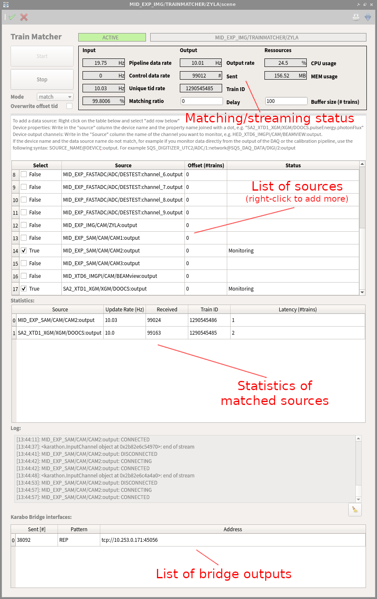

.. _data flow:

Streaming from Karabo
=====================

.. _Karabo: https://doi.org/10.1107/S1600577519006696
.. _karabo-bridge-py: https://github.com/European-XFEL/karabo-bridge-py
.. _ZeroMQ: https://github.com/zeromq

..

At the European XFEL, **EXtra-foam** receives data from the distributed control framework Karabo_.

Data received from different sensors/detectors located at different locations need to be
"aligned" for further analysis. At European XFEL, the accelerator produces 10 bunch trains per
second. As a result, data are stamped and can only be aligned by **Train ID**. For big modular
detectors like AGIPD, LPD, DSSC, etc., alignment of data from different modules are carried out
in the so-called "calibration pipeline". However, in most use cases, users will also want to align
the detector data with motor positions and/or some other detectors (e.g. XGM, digitizer).

Fortunately, the aforementioned alignment is taken care of by *TrainMatcher*
Karabo devices or EXtra-foam, users do not need to worry about that. After the
data from different sources are aligned in a TrainMatcher, they will be
serialized and streamed over ZeroMQ_ using the `Karabo bridge protocol
<https://rtd.xfel.eu/docs/data-analysis-user-documentation/en/latest/karabo_bridge/protocol.html#karabo-bridge-protocol>`_. EXtra-foam
makes use of karabo-bridge-py_, which is a Karabo bridge client implementation,
to receive and deserialize the data.

There are two scenarios for operating EXtra-foam with TrainMatcher devices:

#. The most common scenario is where all necessary data is aligned by a single
   TrainMatcher, and then streamed to EXtra-foam.

   .. graphviz::

      digraph S1 {
          rankdir=LR
          node [style="rounded,filled", shape=box]

          detectors [label="Area detector \n (AGIPD, LPD, DSSC, \n JungFrau, FastCCD, etc)", fillcolor=yellow]
          pipeline_data [label="Pipeline data", fillcolor=yellow]
          control_data [label="Control data", fillcolor=yellow]

          trainmatcher [label="TrainMatcher", fillcolor=lightblue]
          foam [label="EXtra-foam", fillcolor=pink]

          control_data -> trainmatcher;
          pipeline_data -> trainmatcher;
          detectors -> trainmatcher -> foam;
      }

#. One can also send different data items via different TrainMatchers and EXtra-foam will
   align everything automatically after receiving the data. If not all the requested data in a given
   train can be found, the train will be discarded.

   .. graphviz::

      digraph S2 {
          rankdir=LR
          node [style="rounded,filled", shape=box]

          detectors [label="Area detector \n (AGIPD, LPD, DSSC, \n JungFrau, FastCCD, etc)", fillcolor=yellow]
          pipeline_data [label="Pipeline data", fillcolor=yellow]
          control_data [label="Control data", fillcolor=yellow]

          trainmatcher1 [label="TrainMatcher", fillcolor=lightblue]
          trainmatcher2 [label="TrainMatcher", fillcolor=lightblue]
          foam [label="EXtra-foam", fillcolor=pink]

          control_data -> trainmatcher1;
          pipeline_data -> trainmatcher1;
          trainmatcher1 -> foam;
          detectors -> trainmatcher2 -> foam;
      }

   This should rarely be necessary. In most situations having a single
   TrainMatcher as in the first scenario will suffice.

.. _trainmatcher:

Using EXtra-foam with a TrainMatcher
------------------------------------
As mentioned in the previous section, a TrainMatcher is the Karabo device that
matches data from different data sources by train ID. Your instrument should
already have a TrainMatcher set up to use with EXtra-foam (if not, ask your
local DA contact).

This is a screenshot of the TrainMatcher interface, with the particularly
important parts for operation highlighted:

In this case we have a TrainMatcher configured with lots of different sources
(cameras, an XGM, digitizer channels, etc), but only two are being *monitored*
(see the source list): ``MID_EXP_SAM/CAM2:output`` and
``SA2_XTD1_XGM/XGM/DOOCS:output``. Both of these are pipeline sources and both
are getting updated at 10Hz (see the statistics table), which means the
TrainMatcher is matching and streaming data at 10Hz (see the matching/streaming
status at the top). Here the train data is getting streamed over just one Karabo
bridge interface (see the list of outputs at the bottom), but more could be
added if necessary.

To configure a TrainMatcher and connect EXtra-foam to it:

#. Add the sources you want. This can be done by right-clicking the source list
   and adding new items, but sources added like this will not be saved across
   restarts. To permanently add a source, shutdown the device and modify the
   ``Data Sources`` property.
#. Select the sources you want by ticking the boxes for each source. When you're
   done, either hit the Enter key or click the green tick icon in the top left
   to apply the changes.
#. Click the ``Start`` button to start the TrainMatcher.

   .. note::
      The previous two steps (adding sources and enabling/disabling them)
      can be done while the TrainMatcher is running, there's no need to
      stop/start it while reconfiguring the sources.

#. Now we can connect EXtra-foam to the Karabo bridge of the TrainMatcher. In
   EXtra-foam's :ref:`Main_GUI` check the bridge configuration:

   .. image:: images/data_source_from_bridge.png

   The source type should be ``ZeroMQ bridge``, and the IP address and port
   should match the one shown in the TrainMatcher (see the list of bridge
   outputs in the screenshot above).

   If that matches, you should be able to click EXtra-foam's start button and
   begin processing data.

For common issues related to the TrainMatcher and EXtra-foam, see the
:ref:`Operational issues` section.
